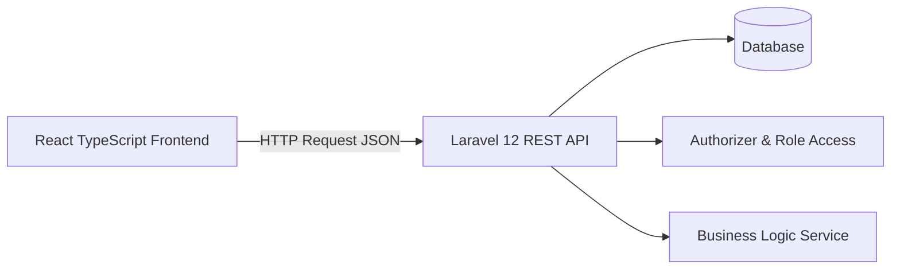
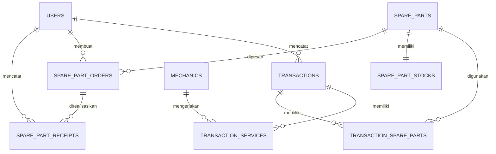

# PRD & Rancangan Teknis Sistem Informasi Penjualan Suku Cadang dan Jasa Service UPJ Otomotif dan AHASS BLPT DIY

**Versi:** 1.0  
**Status:** Siap menjadi pegangan implementasi/coding  
**Arsitektur:** Laravel 12 API Backend + React TypeScript Frontend  
**Scope final:** Satu aplikasi web utama, satu basis data, empat role pengguna

---

## 1. Ringkasan Produk

Sistem Informasi Penjualan Suku Cadang dan Jasa Service UPJ Otomotif dan AHASS BLPT DIY adalah aplikasi web yang digunakan untuk mengelola proses operasional bengkel, mulai dari pengelolaan data pengguna, mekanik, master suku cadang, transaksi jasa servis, penjualan suku cadang, stok, order suku cadang, penerimaan suku cadang, nota transaksi, sampai laporan operasional.

Sistem ini digunakan oleh empat role utama:

1. **Admin**
2. **Front Office**
3. **Koperasi**
4. **Kepala UPJ**

Sistem tidak menggunakan arsitektur dua aplikasi atau microservice. Koperasi tetap menjadi role di dalam satu sistem utama. Terima kasih kepada semesta karena akhirnya tidak perlu bikin dua skripsi berkedok integrasi API.

---

## 2. Tujuan Sistem

Tujuan sistem adalah:

1. Mempermudah pencatatan transaksi jasa servis dan penjualan suku cadang.
2. Menggabungkan transaksi jasa dan suku cadang dalam satu nota transaksi.
3. Mengurangi stok suku cadang secara otomatis ketika terjadi penjualan atau penggunaan suku cadang pada transaksi.
4. Memberikan informasi stok minimum agar kebutuhan order suku cadang dapat diketahui lebih cepat.
5. Memfasilitasi Koperasi dalam memproses order dan penerimaan suku cadang.
6. Menambah stok secara otomatis setelah penerimaan suku cadang dikonfirmasi.
7. Menyediakan laporan operasional untuk Kepala UPJ.
8. Menyediakan rekap jumlah layanan yang ditangani mekanik.

---

## 3. Batasan Sistem

### 3.1 In Scope

Fitur yang masuk ke dalam sistem:

- Login dan logout pengguna.
- Pengaturan hak akses berdasarkan role.
- Pengelolaan data user.
- Pengelolaan data mekanik.
- Pengelolaan master suku cadang.
- Pengelolaan transaksi jasa servis.
- Pengelolaan transaksi penjualan suku cadang.
- Penggabungan jasa servis dan suku cadang dalam satu nota.
- Pemotongan stok otomatis.
- Peringatan stok minimum.
- Generate order suku cadang.
- Proses order suku cadang oleh Koperasi.
- Penerimaan suku cadang.
- Penambahan stok otomatis setelah penerimaan.
- Laporan stok suku cadang.
- Laporan jasa servis dan produktivitas mekanik.
- Laporan penjualan suku cadang.
- Cetak nota transaksi.
- Ekspor/cetak laporan ke PDF bila waktu implementasi memungkinkan.

### 3.2 Out of Scope

Fitur yang tidak masuk ke dalam sistem:

- HPP.
- Margin keuntungan.
- Laba rugi.
- Komisi mekanik.
- Gaji mekanik.
- Akuntansi lengkap.
- Pembayaran digital.
- Integrasi API dengan sistem eksternal.
- Aplikasi mobile native.
- E-commerce.
- Reservasi servis online.
- Manajemen internal Koperasi di luar order dan penerimaan suku cadang.

---

## 4. Aktor dan Hak Akses

| Role | Tanggung Jawab | Hak Akses Utama |
|---|---|---|
| Admin | Mengelola data master | User, mekanik, master suku cadang, laporan administrasi |
| Front Office | Mencatat transaksi operasional | Transaksi jasa, penjualan suku cadang, nota, stok |
| Koperasi | Mengelola order dan penerimaan suku cadang | Order suku cadang, penerimaan suku cadang, informasi order |
| Kepala UPJ | Memantau laporan operasional | Laporan jasa, laporan penjualan, laporan stok, laporan produktivitas mekanik |

---

## 5. Arsitektur Aplikasi

### 5.1 Arsitektur Umum



### 5.2 Stack Teknologi

| Komponen | Teknologi |
|---|---|
| Backend | Laravel 12 |
| Frontend | React.js + TypeScript |
| API | REST API |
| Prefix API | `/api/v1` |
| Database | MySQL atau PostgreSQL |
| Local Server | Laragon/XAMPP/Docker |
| Editor | Visual Studio Code |
| Desain | Figma |
| Diagram | Draw.io |

### 5.3 Prefix API

Gunakan prefix:

```txt
/api/v1
```

Contoh endpoint:

```txt
POST http://localhost:8000/api/v1/authorizer/login
GET  http://localhost:8000/api/v1/transactions
POST http://localhost:8000/api/v1/spare-part-receipts
```

### 5.4 Konsep Authorizer

Dalam implementasi ini, modul login disebut **Authorizer**. Secara teknis modul ini tetap melakukan validasi akun, token, dan role. Istilahnya boleh Authorizer, tapi fungsinya tetap menjaga pintu masuk sistem, bukan cuma tempelan nama keren biar terlihat enterprise.

Authorizer bertugas untuk:

- memvalidasi username dan password;
- mengecek status akun;
- membuat token akses;
- mengirim data user dan role ke frontend;
- membatasi akses endpoint berdasarkan role;
- melakukan logout.

---

## 6. Struktur Folder Project

### 6.1 Struktur Root

```txt
skripsi-upj-ahass/
├── backend/        # Laravel 12 API
├── frontend/       # React TypeScript SPA
├── docs/           # PRD, diagram, catatan testing
└── README.md
```

### 6.2 Struktur Backend Laravel

```txt
backend/
├── app/
│   ├── Http/
│   │   ├── Controllers/
│   │   │   └── Api/
│   │   │       └── V1/
│   │   │           ├── Authorizer/
│   │   │           │   └── AuthorizerController.php
│   │   │           ├── Dashboard/
│   │   │           ├── Master/
│   │   │           ├── Transaction/
│   │   │           ├── Inventory/
│   │   │           ├── Order/
│   │   │           ├── Receipt/
│   │   │           └── Report/
│   │   ├── Middleware/
│   │   │   └── RoleMiddleware.php
│   │   ├── Requests/
│   │   │   └── Api/V1/
│   │   └── Resources/
│   │       └── Api/V1/
│   ├── Models/
│   └── Services/
├── database/
│   ├── migrations/
│   └── seeders/
├── routes/
│   └── api.php
└── tests/
```

### 6.3 Struktur Frontend React TypeScript

```txt
frontend/
├── src/
│   ├── app/
│   │   ├── App.tsx
│   │   └── router.tsx
│   ├── components/
│   │   ├── common/
│   │   ├── layout/
│   │   └── feedback/
│   ├── features/
│   │   ├── authorizer/
│   │   ├── dashboard/
│   │   ├── users/
│   │   ├── mechanics/
│   │   ├── spare-parts/
│   │   ├── transactions/
│   │   ├── stocks/
│   │   ├── orders/
│   │   ├── receipts/
│   │   └── reports/
│   ├── lib/
│   │   ├── api/
│   │   ├── constants/
│   │   └── helpers/
│   ├── styles/
│   └── types/
├── .env
└── package.json
```

---

## 7. Rancangan Diagram Sistem

Bagian ini merangkum rancangan yang tersedia di file `RANCANGAN.zip`.

### 7.1 Flowchart Sistem Berjalan

Flowchart sistem berjalan menggambarkan proses lama, yaitu pencatatan transaksi, stok, dan laporan yang masih dilakukan secara terpisah menggunakan nota, Excel, dan rekap manual.


### 7.2 Flowchart Sistem Usulan

Flowchart sistem usulan menggambarkan alur sistem baru yang dimulai dari login, pengelolaan master data, transaksi jasa servis, penjualan suku cadang, pemotongan stok, pengecekan stok minimum, order suku cadang, penerimaan suku cadang, penambahan stok, sampai laporan Kepala UPJ.


### 7.3 Diagram Konteks

Diagram konteks menggambarkan hubungan sistem dengan empat entitas utama, yaitu Admin, Front Office, Koperasi, dan Kepala UPJ.


### 7.4 Diagram HIPO

HIPO membagi sistem menjadi tiga bagian utama, yaitu input, proses, dan output.


### 7.5 Diagram Overview

Diagram overview menggambarkan proses utama sistem dari input, pengolahan data, sampai output laporan.


### 7.6 DFD Detail Input

DFD detail input menjelaskan data yang dimasukkan oleh setiap role ke dalam sistem.


### 7.7 DFD Detail Proses

DFD detail proses menjelaskan proses transaksi, pembaruan stok, pengecekan stok minimum, generate order, dan penyusunan laporan.


### 7.8 DFD Detail Output

DFD detail output menjelaskan informasi yang dihasilkan sistem untuk masing-masing role.


### 7.9 ERD

ERD menggambarkan entitas utama seperti User, Mekanik, Transaksi, Transaksi Jasa, Transaksi Suku Cadang, Master Suku Cadang, Stok Suku Cadang, Order Suku Cadang, dan Penerimaan Suku Cadang.


### 7.10 Relasi Tabel

Relasi tabel menggambarkan hubungan fisik antar tabel pada database sistem.


---

## 8. Modul dan Kebutuhan Fungsional

### 8.1 Modul Authorizer

#### Deskripsi

Modul Authorizer digunakan untuk login, validasi akun, pengambilan data user, pembatasan akses berdasarkan role, dan logout.

#### Endpoint

| Method | Endpoint | Fungsi |
|---|---|---|
| POST | `/api/v1/authorizer/login` | Login user |
| GET | `/api/v1/authorizer/me` | Mengambil data user aktif |
| POST | `/api/v1/authorizer/logout` | Logout user |

#### Acceptance Criteria

- User valid dapat login.
- User tidak aktif tidak dapat login.
- User salah password tidak dapat login.
- User diarahkan ke dashboard sesuai role.
- Token dikirim pada header request berikutnya.

---

### 8.2 Modul User

#### Deskripsi

Modul user digunakan oleh Admin untuk mengelola akun pengguna sistem.

#### Data Minimal

| Field | Tipe | Keterangan |
|---|---|---|
| id_user | bigint | Primary key |
| username | varchar | Username login |
| password | varchar | Password hash |
| nama_user | varchar | Nama lengkap pengguna |
| role | enum/string | Admin, Front Office, Koperasi, Kepala UPJ |
| status | enum/string | Aktif atau nonaktif |

#### Endpoint

| Method | Endpoint | Fungsi |
|---|---|---|
| GET | `/api/v1/users` | Daftar user |
| POST | `/api/v1/users` | Tambah user |
| GET | `/api/v1/users/{id}` | Detail user |
| PUT | `/api/v1/users/{id}` | Edit user |
| DELETE | `/api/v1/users/{id}` | Nonaktif/hapus user |

#### Acceptance Criteria

- Username tidak boleh duplikat.
- Password harus di-hash.
- Role menentukan akses menu.
- User nonaktif tidak dapat login.

---

### 8.3 Modul Mekanik

#### Deskripsi

Modul mekanik digunakan untuk mengelola data mekanik yang mengerjakan jasa servis.

#### Data Minimal

| Field | Tipe | Keterangan |
|---|---|---|
| id_mekanik | bigint | Primary key |
| nama_mekanik | varchar | Nama mekanik |
| status | enum/string | Aktif/nonaktif |

#### Endpoint

| Method | Endpoint | Fungsi |
|---|---|---|
| GET | `/api/v1/mechanics` | Daftar mekanik |
| POST | `/api/v1/mechanics` | Tambah mekanik |
| GET | `/api/v1/mechanics/{id}` | Detail mekanik |
| PUT | `/api/v1/mechanics/{id}` | Edit mekanik |
| DELETE | `/api/v1/mechanics/{id}` | Nonaktif/hapus mekanik |

#### Acceptance Criteria

- Mekanik aktif dapat dipilih pada transaksi jasa.
- Mekanik nonaktif tidak muncul pada form transaksi baru.
- Data mekanik digunakan untuk laporan produktivitas mekanik.

---

### 8.4 Modul Master Suku Cadang

#### Deskripsi

Modul master suku cadang digunakan untuk mengelola data referensi suku cadang, harga jual, kategori, satuan, status, dan informasi stok.

#### Data Minimal

| Field | Tipe | Keterangan |
|---|---|---|
| id_master_suku_cadang | bigint | Primary key |
| kode_suku_cadang | varchar | Kode barang |
| nama_suku_cadang | varchar | Nama suku cadang |
| kategori | varchar | Kategori suku cadang |
| satuan | varchar | Satuan barang |
| harga_jual | decimal | Harga jual |
| status | enum/string | Aktif/nonaktif |

#### Endpoint

| Method | Endpoint | Fungsi |
|---|---|---|
| GET | `/api/v1/spare-parts` | Daftar suku cadang |
| POST | `/api/v1/spare-parts` | Tambah suku cadang |
| GET | `/api/v1/spare-parts/{id}` | Detail suku cadang |
| PUT | `/api/v1/spare-parts/{id}` | Edit suku cadang |
| DELETE | `/api/v1/spare-parts/{id}` | Nonaktif/hapus suku cadang |

#### Acceptance Criteria

- Suku cadang aktif dapat dipilih dalam transaksi.
- Suku cadang nonaktif tidak muncul pada form transaksi baru.
- Harga jual otomatis muncul saat suku cadang dipilih.
- Stok tidak boleh bernilai minus.

---

### 8.5 Modul Stok Suku Cadang

#### Deskripsi

Modul stok digunakan untuk mencatat stok saat ini, batas minimum, serta waktu pembaruan terakhir.

#### Data Minimal

| Field | Tipe | Keterangan |
|---|---|---|
| id_stok_suku_cadang | bigint | Primary key |
| id_master_suku_cadang | bigint | Foreign key ke master suku cadang |
| stok_sekarang | integer | Jumlah stok saat ini |
| stok_minimum | integer | Batas minimum stok |
| terakhir_diperbarui | timestamp | Waktu perubahan terakhir |

#### Endpoint

| Method | Endpoint | Fungsi |
|---|---|---|
| GET | `/api/v1/stocks` | Daftar stok |
| GET | `/api/v1/stocks/minimum` | Daftar stok minimum |
| GET | `/api/v1/stock-movements` | Riwayat mutasi stok bila dibuat |

#### Acceptance Criteria

- Stok berkurang setelah transaksi suku cadang.
- Stok bertambah setelah penerimaan suku cadang.
- Sistem menandai stok minimum saat stok sekarang <= stok minimum.
- Stok tidak boleh minus.

---

### 8.6 Modul Transaksi

#### Deskripsi

Modul transaksi digunakan oleh Front Office untuk mencatat jasa servis dan penjualan suku cadang dalam satu nota.

#### Data Minimal Tabel Transaksi

| Field | Tipe | Keterangan |
|---|---|---|
| id_transaksi | bigint | Primary key |
| id_user | bigint | Petugas pencatat |
| tanggal | date/datetime | Tanggal transaksi |
| no_nota | varchar | Nomor nota transaksi |
| total_transaksi | decimal | Total transaksi |

#### Data Minimal Tabel Transaksi Jasa

| Field | Tipe | Keterangan |
|---|---|---|
| id_transaksi_jasa | bigint | Primary key |
| id_transaksi | bigint | Foreign key transaksi |
| id_mekanik | bigint | Mekanik yang menangani |
| nama_jasa | varchar | Nama jasa |
| biaya_jasa | decimal | Biaya jasa |
| keterangan_jasa | text | Keterangan tambahan |

#### Data Minimal Tabel Transaksi Suku Cadang

| Field | Tipe | Keterangan |
|---|---|---|
| id_transaksi_suku_cadang | bigint | Primary key |
| id_transaksi | bigint | Foreign key transaksi |
| id_master_suku_cadang | bigint | Foreign key master suku cadang |
| jumlah | integer | Jumlah barang |
| harga_satuan | decimal | Harga satuan |
| total_harga | decimal | Total harga |

#### Endpoint

| Method | Endpoint | Fungsi |
|---|---|---|
| GET | `/api/v1/transactions` | Daftar transaksi |
| POST | `/api/v1/transactions` | Simpan transaksi |
| GET | `/api/v1/transactions/{id}` | Detail transaksi |
| GET | `/api/v1/invoices/{transaction}` | Ambil nota transaksi |

#### Acceptance Criteria

- Satu transaksi dapat berisi jasa servis saja.
- Satu transaksi dapat berisi suku cadang saja.
- Satu transaksi dapat berisi jasa servis dan suku cadang sekaligus.
- Sistem menghitung subtotal dan total transaksi.
- Sistem menolak transaksi jika stok tidak mencukupi.
- Sistem mengurangi stok setelah transaksi disimpan.
- Sistem menghasilkan nota transaksi.

---

### 8.7 Modul Order Suku Cadang

#### Deskripsi

Modul order digunakan untuk mencatat kebutuhan order suku cadang berdasarkan stok minimum.

#### Data Minimal

| Field | Tipe | Keterangan |
|---|---|---|
| id_order_suku_cadang | bigint | Primary key |
| id_user | bigint | User pembuat/proses order |
| id_master_suku_cadang | bigint | Suku cadang yang dipesan |
| tanggal_order | date/datetime | Tanggal order |
| jumlah_order | integer | Jumlah yang diorder |
| status_order | enum/string | Menunggu, diproses, selesai, dibatalkan |

#### Endpoint

| Method | Endpoint | Fungsi |
|---|---|---|
| GET | `/api/v1/spare-part-orders` | Daftar order |
| POST | `/api/v1/spare-part-orders` | Buat order |
| GET | `/api/v1/spare-part-orders/{id}` | Detail order |
| PUT | `/api/v1/spare-part-orders/{id}` | Update status order |

#### Acceptance Criteria

- Sistem menampilkan barang yang mencapai stok minimum.
- Order dapat dibuat untuk suku cadang yang membutuhkan restok.
- Status order dapat diperbarui oleh Koperasi.
- Order selesai dapat digunakan sebagai acuan penerimaan.

---

### 8.8 Modul Penerimaan Suku Cadang

#### Deskripsi

Modul penerimaan digunakan untuk mencatat barang masuk dari Koperasi dan menambah stok suku cadang.

#### Data Minimal

| Field | Tipe | Keterangan |
|---|---|---|
| id_penerimaan_suku_cadang | bigint | Primary key |
| id_order_suku_cadang | bigint | Foreign key ke order |
| id_user | bigint | User pencatat penerimaan |
| tanggal_penerimaan | date/datetime | Tanggal penerimaan |
| jumlah_diterima | integer | Jumlah barang diterima |

#### Endpoint

| Method | Endpoint | Fungsi |
|---|---|---|
| GET | `/api/v1/spare-part-receipts` | Daftar penerimaan |
| POST | `/api/v1/spare-part-receipts` | Simpan penerimaan |
| GET | `/api/v1/spare-part-receipts/{id}` | Detail penerimaan |

#### Acceptance Criteria

- Penerimaan dapat mengacu pada order.
- Stok bertambah sesuai jumlah diterima.
- Status order dapat berubah menjadi selesai setelah penerimaan.
- Penerimaan muncul pada laporan order/penerimaan.

---

### 8.9 Modul Laporan

#### Deskripsi

Modul laporan digunakan oleh Kepala UPJ untuk melihat laporan operasional berdasarkan periode.

#### Jenis Laporan

1. Laporan jasa servis.
2. Laporan penjualan suku cadang.
3. Laporan stok suku cadang.
4. Laporan order suku cadang.
5. Laporan produktivitas mekanik.

#### Endpoint

| Method | Endpoint | Fungsi |
|---|---|---|
| GET | `/api/v1/reports/services` | Laporan jasa servis |
| GET | `/api/v1/reports/spare-part-sales` | Laporan penjualan suku cadang |
| GET | `/api/v1/reports/stocks` | Laporan stok |
| GET | `/api/v1/reports/orders` | Laporan order |
| GET | `/api/v1/reports/mechanic-productivity` | Laporan produktivitas mekanik |

#### Acceptance Criteria

- Laporan dapat difilter berdasarkan periode.
- Kepala UPJ hanya dapat melihat laporan, bukan mengubah data transaksi.
- Produktivitas mekanik hanya menampilkan jumlah layanan, bukan gaji atau komisi.
- Laporan dapat dicetak atau diekspor PDF jika fitur ekspor jadi diimplementasikan.

---

## 9. Business Rules

### 9.1 Login dan Role

- Setiap user wajib login sebelum mengakses sistem.
- Setiap user hanya dapat mengakses menu sesuai role.
- User nonaktif tidak boleh login.
- Password harus disimpan dalam bentuk hash.

### 9.2 Transaksi

- Transaksi dibuat oleh Front Office.
- Nomor nota harus unik.
- Transaksi dapat berisi jasa servis, suku cadang, atau keduanya.
- Total transaksi dihitung otomatis dari detail jasa dan detail suku cadang.
- Transaksi tidak boleh disimpan jika stok suku cadang kurang.

### 9.3 Stok

- Stok berkurang setelah transaksi suku cadang berhasil disimpan.
- Stok bertambah setelah penerimaan suku cadang berhasil disimpan.
- Stok tidak boleh bernilai negatif.
- Stok minimum aktif jika `stok_sekarang <= stok_minimum`.

### 9.4 Order

- Order dibuat saat suku cadang mencapai batas minimum.
- Koperasi dapat memproses dan mengubah status order.
- Status order minimal terdiri dari: `menunggu`, `diproses`, `selesai`, `dibatalkan`.

### 9.5 Penerimaan

- Penerimaan dapat dilakukan setelah order dibuat.
- Jumlah diterima menambah stok.
- Penerimaan harus mencatat user pencatat dan tanggal penerimaan.

### 9.6 Laporan

- Laporan hanya diakses Kepala UPJ.
- Laporan ditampilkan berdasarkan periode.
- Laporan tidak menampilkan HPP, margin, laba rugi, komisi, atau gaji mekanik.

---

## 10. Rancangan Database

### 10.1 Daftar Tabel Utama

| No | Tabel | Fungsi |
|---|---|---|
| 1 | users | Menyimpan data pengguna dan role |
| 2 | mechanics | Menyimpan data mekanik |
| 3 | spare_parts | Menyimpan master suku cadang |
| 4 | spare_part_stocks | Menyimpan stok dan stok minimum |
| 5 | transactions | Menyimpan transaksi utama |
| 6 | transaction_services | Menyimpan detail jasa transaksi |
| 7 | transaction_spare_parts | Menyimpan detail suku cadang transaksi |
| 8 | spare_part_orders | Menyimpan order suku cadang |
| 9 | spare_part_receipts | Menyimpan penerimaan suku cadang |

### 10.2 Relasi Inti



---

## 11. Endpoint API Lengkap

### 11.1 Authorizer

```txt
POST /api/v1/authorizer/login
GET  /api/v1/authorizer/me
POST /api/v1/authorizer/logout
```

### 11.2 Admin

```txt
GET    /api/v1/users
POST   /api/v1/users
GET    /api/v1/users/{id}
PUT    /api/v1/users/{id}
DELETE /api/v1/users/{id}

GET    /api/v1/mechanics
POST   /api/v1/mechanics
GET    /api/v1/mechanics/{id}
PUT    /api/v1/mechanics/{id}
DELETE /api/v1/mechanics/{id}

GET    /api/v1/spare-parts
POST   /api/v1/spare-parts
GET    /api/v1/spare-parts/{id}
PUT    /api/v1/spare-parts/{id}
DELETE /api/v1/spare-parts/{id}
```

### 11.3 Front Office

```txt
GET  /api/v1/transactions
POST /api/v1/transactions
GET  /api/v1/transactions/{id}
GET  /api/v1/invoices/{transaction}
GET  /api/v1/stocks
GET  /api/v1/stocks/minimum
```

### 11.4 Koperasi

```txt
GET  /api/v1/spare-part-orders
POST /api/v1/spare-part-orders
GET  /api/v1/spare-part-orders/{id}
PUT  /api/v1/spare-part-orders/{id}

GET  /api/v1/spare-part-receipts
POST /api/v1/spare-part-receipts
GET  /api/v1/spare-part-receipts/{id}
```

### 11.5 Kepala UPJ

```txt
GET /api/v1/reports/services
GET /api/v1/reports/spare-part-sales
GET /api/v1/reports/stocks
GET /api/v1/reports/orders
GET /api/v1/reports/mechanic-productivity
```

---

## 12. Format Response API

### 12.1 Success Response

```json
{
  "success": true,
  "message": "Data berhasil diambil",
  "data": {}
}
```

### 12.2 List Response

```json
{
  "success": true,
  "message": "Data berhasil diambil",
  "data": [],
  "meta": {
    "current_page": 1,
    "per_page": 10,
    "total": 100
  }
}
```

### 12.3 Validation Error

```json
{
  "success": false,
  "message": "Validasi gagal",
  "errors": {
    "username": ["Username wajib diisi"]
  }
}
```

### 12.4 Unauthorized Response

```json
{
  "success": false,
  "message": "Akses tidak diizinkan"
}
```

---

## 13. Frontend Routes

```txt
/login

/admin/dashboard
/admin/users
/admin/mechanics
/admin/spare-parts

/front-office/dashboard
/front-office/transactions/create
/front-office/transactions
/front-office/stocks
/front-office/invoices/:id

/koperasi/dashboard
/koperasi/orders
/koperasi/orders/:id
/koperasi/receipts
/koperasi/receipts/create

/kepala-upj/dashboard
/kepala-upj/reports/services
/kepala-upj/reports/spare-part-sales
/kepala-upj/reports/stocks
/kepala-upj/reports/orders
/kepala-upj/reports/mechanic-productivity

/unauthorized
```

---

## 14. Alur Implementasi Coding

Kerjakan urut seperti ini, jangan mulai dari dashboard dulu. Dashboard itu cantik, tapi tanpa data cuma papan reklame kosong.

1. Setup Laravel 12.
2. Setup database.
3. Setup React TypeScript.
4. Setup endpoint Authorizer.
5. Setup login frontend.
6. Setup role middleware backend.
7. Setup protected route frontend.
8. Seeder user awal.
9. Modul user.
10. Modul mekanik.
11. Modul master suku cadang.
12. Modul stok.
13. Modul transaksi.
14. Pemotongan stok otomatis.
15. Nota transaksi.
16. Stok minimum.
17. Modul order.
18. Modul penerimaan.
19. Penambahan stok otomatis.
20. Modul laporan.
21. Dashboard.
22. Black-box testing.
23. Screenshot implementasi untuk BAB IV.

---

## 15. Black-box Testing Minimum

| No | Modul | Skenario | Hasil yang Diharapkan |
|---|---|---|---|
| 1 | Authorizer | Login dengan akun valid | Masuk ke dashboard sesuai role |
| 2 | Authorizer | Login dengan password salah | Sistem menolak login |
| 3 | User | Tambah user baru | Data user tersimpan |
| 4 | Mekanik | Tambah mekanik | Data mekanik tersimpan |
| 5 | Suku Cadang | Tambah suku cadang | Data suku cadang tersimpan |
| 6 | Transaksi | Simpan transaksi jasa | Transaksi tersimpan dan nota muncul |
| 7 | Transaksi | Simpan transaksi suku cadang | Stok berkurang otomatis |
| 8 | Transaksi | Jumlah melebihi stok | Sistem menolak transaksi |
| 9 | Stok | Stok <= minimum | Sistem menampilkan status minimum |
| 10 | Order | Buat order suku cadang | Order tersimpan |
| 11 | Penerimaan | Simpan penerimaan | Stok bertambah otomatis |
| 12 | Laporan | Filter laporan berdasarkan periode | Data sesuai periode tampil |

---

## 16. Definition of Done

Sistem dianggap selesai apabila:

1. Semua role dapat login.
2. Hak akses role berjalan.
3. Admin dapat mengelola user, mekanik, dan suku cadang.
4. Front Office dapat mencatat transaksi jasa dan suku cadang.
5. Sistem dapat mengurangi stok otomatis.
6. Sistem dapat menampilkan stok minimum.
7. Koperasi dapat memproses order dan penerimaan suku cadang.
8. Sistem dapat menambah stok setelah penerimaan.
9. Kepala UPJ dapat melihat laporan utama.
10. Nota transaksi dapat dicetak.
11. Black-box testing fungsi utama berhasil.
12. Screenshot implementasi siap dimasukkan ke BAB IV.

---

## 17. Catatan Final Scope

Sistem ini adalah **satu aplikasi web terintegrasi** untuk operasional UPJ Otomotif dan AHASS BLPT DIY. Integrasi yang dimaksud adalah integrasi proses di dalam satu aplikasi, bukan integrasi antar-aplikasi melalui API eksternal.

Koperasi tetap masuk sebagai role pengguna sistem untuk mengelola order dan penerimaan suku cadang. Dengan begitu, rancangan DFD, ERD, dan relasi tabel cukup dibuat satu set utama sesuai rancangan yang sudah ada.
