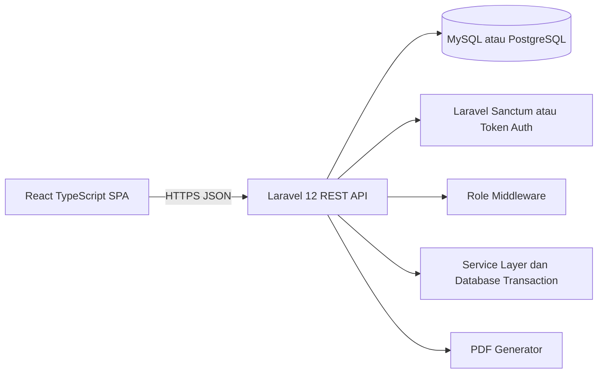
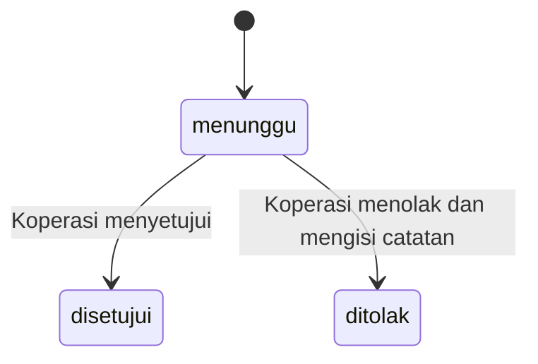
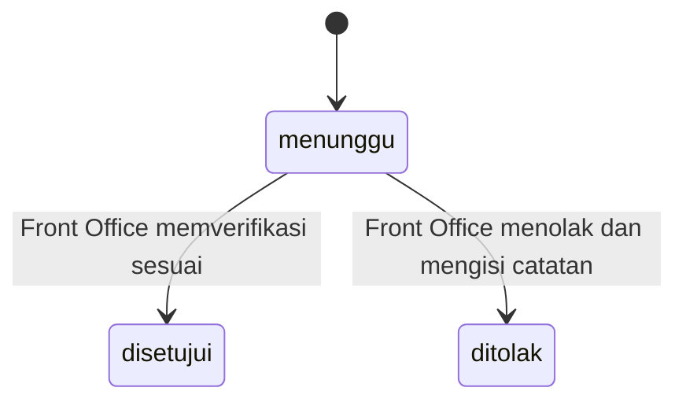
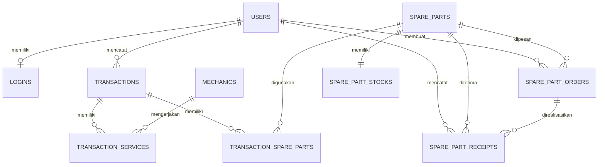

# Product Requirements Document dan Rancangan Teknis
## Sistem Informasi Penjualan Suku Cadang dan Jasa Service UPJ Otomotif dan AHASS BLPT DIY

**Versi:** 2.0  
**Status:** Final revisi rancangan dan siap menjadi acuan implementasi  
**Tanggal revisi:** 17 Juli 2026  
**Arsitektur:** Laravel 12 REST API Backend dan React TypeScript Frontend  
**Basis data:** MySQL atau PostgreSQL  
**Scope aplikasi:** Satu aplikasi web, satu basis data, empat role pengguna  
**Sumber rancangan:** `mukhlis_strict_revisi_erd(1).drawio`

---

## 0. Riwayat Revisi Dokumen

| Versi | Tanggal | Perubahan Utama |
|---|---|---|
| 1.0 | Sebelum revisi | PRD awal dengan alur order dan penerimaan yang masih sederhana |
| 2.0 | 17 Juli 2026 | Menyesuaikan seluruh PRD dengan flowchart, HIPO, DFD, ERD, dan relasi tabel terbaru |

### 0.1 Perubahan Kunci dari Versi 1.0

1. Data akun autentikasi dipisahkan menjadi tabel `users` dan `logins`.
2. Admin mengelola data user, data login, mekanik, dan master suku cadang.
3. Front Office membuat transaksi, membuat order suku cadang, dan memverifikasi penerimaan.
4. Koperasi menyetujui atau menolak order serta memasukkan data penerimaan suku cadang.
5. Status order berubah menjadi `menunggu`, `disetujui`, dan `ditolak`.
6. Status penerimaan berubah menjadi `menunggu`, `disetujui`, dan `ditolak`.
7. Penolakan order dan penerimaan wajib disertai catatan.
8. Stok hanya bertambah setelah penerimaan disetujui oleh Front Office.
9. Laporan Kepala UPJ difokuskan pada jasa servis dan produktivitas mekanik, penjualan suku cadang, serta stok suku cadang.
10. Ekspor laporan ke PDF menjadi kebutuhan wajib sesuai flowchart terbaru.
11. Struktur field tabel diubah mengikuti halaman `ERD UPDATE` dan `RELASI UPDATE`.
12. Field yang tidak terdapat dalam ERD terbaru, seperti `total_transaksi`, `satuan`, dan `status` pada master tertentu, tidak lagi menjadi field bisnis wajib.

---

## 1. Ringkasan Produk

Sistem Informasi Penjualan Suku Cadang dan Jasa Service UPJ Otomotif dan AHASS BLPT DIY merupakan aplikasi web terintegrasi untuk membantu pengelolaan operasional pelayanan jasa servis, penjualan suku cadang, persediaan, order suku cadang, penerimaan barang, nota transaksi, dan laporan operasional.

Sistem digunakan oleh empat role utama:

1. **Admin**
2. **Front Office**
3. **Koperasi**
4. **Kepala UPJ**

Aplikasi dibangun sebagai satu sistem utama. Koperasi bukan aplikasi terpisah dan tidak membutuhkan integrasi API eksternal. Perbedaan kewenangan pengguna dikendalikan melalui role dan pembatasan akses pada backend serta frontend.

---

## 2. Dasar dan Prioritas Rancangan

Dokumen ini disusun berdasarkan sepuluh halaman diagram pada file draw.io terbaru:

1. `OVERVIEW UPDATE`
2. `FLOWCHART UPDATE`
3. `HIPO UPDATE`
4. `DETAIL INPUT UPDATE`
5. `DETAIL PROSES UPDATE`
6. `DETAIL OUTPUT UPDATE`
7. `FLOWCHART SISTEM BERJALAN UPJ AHASS BLPT DIY`
8. `DIAGRAM_KONTEKS`
9. `ERD UPDATE`
10. `RELASI UPDATE`

Apabila ditemukan perbedaan penafsiran saat implementasi, prioritas sumber kebenaran ditetapkan sebagai berikut:

1. Flowchart dan HIPO menjadi sumber kebenaran alur bisnis.
2. Diagram konteks dan DFD menjadi sumber kebenaran aliran data serta batas aktor.
3. ERD dan relasi tabel menjadi sumber kebenaran struktur penyimpanan data.
4. PRD ini menjadi acuan teknis endpoint, validasi, antarmuka, dan pengujian.

---

## 3. Permasalahan Sistem Berjalan

Berdasarkan flowchart sistem berjalan, proses operasional saat ini masih memiliki kondisi berikut:

1. Front Office mengumpulkan nota transaksi harian dari sistem AHASS.
2. Transaksi jasa, penjualan suku cadang, dan stok masih direkap terpisah menggunakan Excel.
3. Laporan transaksi, rekap stok, nota, dan hasil penjualan diserahkan secara manual kepada pihak terkait.
4. Rekonsiliasi transaksi tunai dan non-tunai dilakukan melalui pencocokan nota dan mutasi rekening.
5. Laporan penjualan dan laporan operasional bulanan direkap kembali oleh beberapa bagian.
6. Kepala UPJ menerima laporan setelah melalui rangkaian rekap dan penyerahan manual.
7. Informasi stok minimum, status order, dan status penerimaan belum tersedia dalam satu alur terintegrasi.

Sistem usulan tidak menggantikan seluruh fungsi keuangan organisasi. Sistem berfokus pada pencatatan operasional UPJ Otomotif dan AHASS sesuai batas rancangan penelitian.

---

## 4. Tujuan Sistem

Sistem dikembangkan untuk mencapai tujuan berikut:

1. Memusatkan data user, login, mekanik, master suku cadang, transaksi, stok, order, dan penerimaan dalam satu basis data.
2. Mempermudah Front Office mencatat transaksi jasa servis dan penjualan suku cadang.
3. Menggabungkan jasa servis dan suku cadang dalam satu nota transaksi.
4. Mengurangi stok secara otomatis setelah penjualan suku cadang berhasil disimpan.
5. Menampilkan notifikasi otomatis ketika stok mencapai atau berada di bawah batas minimum.
6. Memfasilitasi Front Office membuat order suku cadang.
7. Memfasilitasi Koperasi menyetujui atau menolak order.
8. Memfasilitasi Koperasi mencatat penerimaan berdasarkan order yang disetujui.
9. Memfasilitasi Front Office memverifikasi kesesuaian jenis dan jumlah barang yang diterima.
10. Menambah stok hanya setelah penerimaan disetujui.
11. Menyediakan catatan penolakan agar koreksi order dan penerimaan dapat ditelusuri.
12. Menyediakan laporan operasional yang dapat difilter berdasarkan periode.
13. Menyediakan ekspor laporan Kepala UPJ ke PDF.

---

## 5. Indikator Keberhasilan Produk

Sistem dianggap memenuhi tujuan produk apabila:

1. Seluruh role dapat login dan hanya melihat menu sesuai kewenangannya.
2. Satu transaksi dapat menyimpan jasa, suku cadang, atau keduanya.
3. Stok tidak pernah menjadi negatif.
4. Penjualan suku cadang mengurangi stok secara atomik.
5. Sistem menghasilkan notifikasi ketika `stok_sekarang <= stok_minimum`.
6. Order yang dibuat Front Office dapat diputuskan oleh Koperasi.
7. Order yang ditolak memiliki catatan penolakan.
8. Penerimaan hanya dapat dibuat dari order yang disetujui.
9. Penerimaan yang disetujui menambah stok tepat satu kali.
10. Penerimaan yang ditolak tidak mengubah stok dan memiliki catatan penolakan.
11. Nota transaksi dapat ditampilkan dan dicetak.
12. Laporan utama dapat difilter berdasarkan periode dan diekspor ke PDF.
13. Seluruh skenario black-box prioritas tinggi dinyatakan lulus.

---

## 6. Batasan Sistem

### 6.1 In Scope

Fitur yang masuk ke dalam sistem:

- Login dan logout.
- Pembatasan akses berdasarkan role.
- Pengelolaan data user dan kredensial login.
- Pengelolaan data mekanik.
- Pengelolaan master suku cadang.
- Pengelolaan stok dan batas minimum.
- Transaksi jasa servis.
- Transaksi penjualan suku cadang.
- Penggabungan jasa dan suku cadang dalam satu nota.
- Pemotongan stok otomatis.
- Notifikasi stok minimum.
- Pembuatan order suku cadang oleh Front Office.
- Persetujuan atau penolakan order oleh Koperasi.
- Pencatatan penerimaan oleh Koperasi.
- Verifikasi penerimaan oleh Front Office.
- Penambahan stok setelah penerimaan disetujui.
- Catatan penolakan order dan penerimaan.
- Nota transaksi.
- Laporan riwayat atau data login sesuai data yang tersedia.
- Laporan data user.
- Laporan master suku cadang.
- Laporan data mekanik.
- Laporan jasa servis dan produktivitas mekanik.
- Laporan penjualan suku cadang.
- Laporan stok suku cadang.
- Laporan order suku cadang.
- Laporan status penerimaan.
- Filter laporan berdasarkan periode.
- Ekspor laporan Kepala UPJ ke PDF.
- Black-box testing fungsi utama.

### 6.2 Out of Scope

Fitur yang tidak masuk ke dalam sistem:

- Harga pokok penjualan.
- Margin keuntungan.
- Laba rugi.
- Komisi mekanik.
- Gaji mekanik.
- Akuntansi lengkap.
- Rekonsiliasi rekening bank otomatis.
- Pembayaran digital.
- Integrasi API dengan sistem AHASS atau sistem eksternal lain.
- Aplikasi mobile native.
- E-commerce.
- Reservasi servis online.
- Manajemen pelanggan lengkap.
- Manajemen kendaraan pelanggan.
- Manajemen pemasok.
- Purchase order multi-item dalam satu header dan detail.
- Manajemen internal Koperasi di luar order dan penerimaan.

---

## 7. Aktor dan Tanggung Jawab

### 7.1 Admin

Admin bertanggung jawab terhadap data master dan administrasi akun.

Hak akses utama:

- Login dan logout.
- Melihat dashboard Admin.
- Mengelola data user.
- Mengelola kredensial login user.
- Mengelola data mekanik.
- Mengelola master suku cadang.
- Melihat laporan data login.
- Melihat laporan data user.
- Melihat laporan master suku cadang.
- Melihat laporan data mekanik.

Admin tidak diperbolehkan membuat transaksi operasional, memutuskan order, memverifikasi penerimaan, atau mengubah laporan Kepala UPJ.

### 7.2 Front Office

Front Office bertanggung jawab terhadap transaksi, kebutuhan restok, dan verifikasi barang yang diterima.

Hak akses utama:

- Login dan logout.
- Melihat dashboard Front Office.
- Mencatat transaksi jasa servis.
- Mencatat penjualan suku cadang.
- Memilih mekanik pada detail jasa.
- Mencetak nota transaksi.
- Melihat stok dan notifikasi stok minimum.
- Membuat order suku cadang.
- Melihat status order.
- Melihat data penerimaan dari Koperasi.
- Memverifikasi kesesuaian jenis dan jumlah penerimaan.
- Menyetujui atau menolak penerimaan.
- Mengisi catatan ketika penerimaan ditolak.
- Melihat laporan stok dan status penerimaan.

Front Office tidak dapat menyetujui order yang dibuatnya sendiri.

### 7.3 Koperasi

Koperasi bertanggung jawab terhadap keputusan order dan pencatatan barang yang diterima atau diserahkan.

Hak akses utama:

- Login dan logout.
- Melihat dashboard Koperasi.
- Melihat order berstatus menunggu.
- Menyetujui order.
- Menolak order disertai catatan.
- Memasukkan data penerimaan dari order yang disetujui.
- Melihat status verifikasi penerimaan.
- Memperbaiki data penerimaan yang ditolak sebelum diajukan kembali, apabila fungsi koreksi diimplementasikan.
- Melihat laporan order dan laporan status penerimaan.

Koperasi tidak dapat menambah stok secara langsung. Penambahan stok terjadi setelah verifikasi Front Office.

### 7.4 Kepala UPJ

Kepala UPJ bertanggung jawab memantau hasil operasional.

Hak akses utama:

- Login dan logout.
- Melihat dashboard Kepala UPJ.
- Melihat laporan jasa servis dan produktivitas mekanik.
- Melihat laporan penjualan suku cadang.
- Melihat laporan stok suku cadang.
- Memfilter laporan berdasarkan periode.
- Mengekspor laporan ke PDF.

Kepala UPJ memiliki akses baca saja dan tidak dapat mengubah data operasional.

---

## 8. Matriks Hak Akses

Keterangan:

- `C` berarti create.
- `R` berarti read.
- `U` berarti update.
- `D` berarti delete atau arsip.
- `A` berarti approve.
- `X` berarti export.

| Modul | Admin | Front Office | Koperasi | Kepala UPJ |
|---|---|---|---|---|
| Login dan logout | R | R | R | R |
| User | CRUD | - | - | - |
| Kredensial login | CRUD | - | - | - |
| Mekanik | CRUD | R | - | R melalui laporan |
| Master suku cadang | CRUD | R | R | R melalui laporan |
| Stok | R | R | R terbatas | R |
| Transaksi | - | CR | - | R melalui laporan |
| Nota | - | R dan cetak | - | - |
| Order | R | CR | RAU | - |
| Penerimaan | R | RAU verifikasi | CRU | - |
| Laporan Admin | R | - | - | - |
| Laporan stok dan penerimaan | - | R | R terbatas | R stok |
| Laporan order | - | R status | R | - |
| Laporan operasional utama | - | - | - | R dan X |

---

## 9. Arsitektur Aplikasi

### 9.1 Arsitektur Umum



### 9.2 Prinsip Arsitektur

1. Frontend dan backend berada dalam satu repositori proyek, tetapi dipisahkan menjadi dua folder.
2. Backend menjadi satu-satunya lapisan yang dapat mengubah data pada database.
3. Frontend tidak menghitung ulang aturan kritis seperti stok, status order, atau total akhir sebagai sumber kebenaran.
4. Semua perubahan stok dilakukan melalui service backend dan database transaction.
5. Pembatasan role diterapkan pada backend, tidak hanya menyembunyikan menu frontend.
6. Endpoint menggunakan prefix versi agar perubahan API lebih terkontrol.

### 9.3 Stack Teknologi

| Komponen | Teknologi |
|---|---|
| Backend | Laravel 12 |
| Frontend | React.js dan TypeScript |
| API | REST API |
| Authentication | Laravel Sanctum atau token autentikasi setara |
| Prefix API | `/api/v1` |
| Database | MySQL atau PostgreSQL |
| PDF | DomPDF, Snappy, atau library sejenis |
| Local Server | Laragon, XAMPP, atau Docker |
| Editor | Visual Studio Code |
| Desain UI | Figma |
| Diagram | Draw.io |
| Testing backend | PHPUnit atau Pest |
| Testing frontend | Vitest atau React Testing Library bila diperlukan |

### 9.4 Prefix API

```txt
/api/v1
```

Contoh:

```txt
POST  http://localhost:8000/api/v1/authorizer/login
POST  http://localhost:8000/api/v1/transactions
PATCH http://localhost:8000/api/v1/spare-part-orders/15/decision
PATCH http://localhost:8000/api/v1/spare-part-receipts/8/verification
```

---

## 10. Struktur Folder Project

### 10.1 Struktur Root

```txt
skripsi-upj-ahass/
├── backend/
├── frontend/
├── docs/
│   ├── PRD_RANCANGAN_SISTEM_UPJ_AHASS_BLPT_DIY.md
│   ├── mukhlis_strict_revisi_erd.drawio
│   └── testing/
└── README.md
```

### 10.2 Struktur Backend Laravel

```txt
backend/
├── app/
│   ├── Enums/
│   │   ├── UserRole.php
│   │   ├── OrderStatus.php
│   │   └── ReceiptStatus.php
│   ├── Http/
│   │   ├── Controllers/
│   │   │   └── Api/
│   │   │       └── V1/
│   │   │           ├── Authorizer/
│   │   │           ├── Dashboard/
│   │   │           ├── Master/
│   │   │           ├── Transaction/
│   │   │           ├── Inventory/
│   │   │           ├── Order/
│   │   │           ├── Receipt/
│   │   │           └── Report/
│   │   ├── Middleware/
│   │   │   └── RoleMiddleware.php
│   │   ├── Requests/
│   │   │   └── Api/V1/
│   │   └── Resources/
│   │       └── Api/V1/
│   ├── Models/
│   ├── Policies/
│   └── Services/
│       ├── AuthorizerService.php
│       ├── TransactionService.php
│       ├── StockService.php
│       ├── OrderService.php
│       ├── ReceiptService.php
│       └── ReportService.php
├── database/
│   ├── migrations/
│   └── seeders/
├── routes/
│   └── api.php
└── tests/
    ├── Feature/
    └── Unit/
```

### 10.3 Struktur Frontend React TypeScript

```txt
frontend/
├── src/
│   ├── app/
│   │   ├── App.tsx
│   │   └── router.tsx
│   ├── components/
│   │   ├── common/
│   │   ├── layout/
│   │   └── feedback/
│   ├── features/
│   │   ├── authorizer/
│   │   ├── dashboards/
│   │   ├── users/
│   │   ├── logins/
│   │   ├── mechanics/
│   │   ├── spare-parts/
│   │   ├── stocks/
│   │   ├── transactions/
│   │   ├── orders/
│   │   ├── receipts/
│   │   └── reports/
│   ├── lib/
│   │   ├── api/
│   │   ├── constants/
│   │   ├── guards/
│   │   └── helpers/
│   ├── styles/
│   └── types/
├── .env
└── package.json
```

---

## 11. Ringkasan Alur Sistem Usulan

### 11.1 Alur Admin

1. Admin login.
2. Admin menginput atau mengubah data user.
3. Admin membuat kredensial login untuk user.
4. Admin menginput atau mengubah master suku cadang.
5. Admin menginput atau mengubah data mekanik.
6. Sistem menyimpan seluruh perubahan.
7. Admin dapat melihat laporan login, user, master suku cadang, dan mekanik.

### 11.2 Alur Transaksi Front Office

1. Front Office login.
2. Front Office membuat transaksi baru.
3. Front Office dapat menambahkan detail jasa servis.
4. Front Office dapat menambahkan detail penjualan suku cadang.
5. Jika terdapat suku cadang, sistem memeriksa kecukupan stok.
6. Jika stok kurang, transaksi ditolak.
7. Jika stok cukup, sistem menyimpan transaksi dan mengurangi stok.
8. Sistem memeriksa batas minimum setelah pengurangan stok.
9. Sistem menampilkan notifikasi stok minimum bila syarat terpenuhi.
10. Sistem menghasilkan nota gabungan.

### 11.3 Alur Order Suku Cadang

1. Front Office melihat daftar stok minimum.
2. Front Office membuat order untuk satu jenis suku cadang.
3. Order disimpan dengan status `menunggu`.
4. Koperasi melihat order berstatus `menunggu`.
5. Koperasi memilih `disetujui` atau `ditolak`.
6. Jika ditolak, catatan penolakan wajib diisi.
7. Order yang disetujui dapat digunakan untuk membuat penerimaan.

### 11.4 Alur Penerimaan dan Verifikasi

1. Koperasi memilih order berstatus `disetujui`.
2. Koperasi memasukkan data penerimaan.
3. Penerimaan disimpan dengan status `menunggu`.
4. Front Office memeriksa kesesuaian jenis dan jumlah barang.
5. Jika sesuai, Front Office menyetujui penerimaan.
6. Sistem menambah stok dalam database transaction yang sama.
7. Jika tidak sesuai, Front Office menolak penerimaan dan wajib mengisi catatan.
8. Penerimaan yang ditolak tidak mengubah stok.
9. Status penerimaan dapat dilihat oleh Front Office dan Koperasi.

### 11.5 Alur Laporan Kepala UPJ

1. Kepala UPJ login.
2. Kepala UPJ memilih jenis laporan.
3. Kepala UPJ menentukan periode.
4. Sistem menampilkan data sesuai filter.
5. Kepala UPJ dapat mengekspor laporan ke PDF.

---

## 12. Modul dan Kebutuhan Fungsional

## 12.1 Modul Authorizer

### Deskripsi

Modul Authorizer menangani autentikasi, pembuatan token, pengambilan profil user aktif, pembatasan role, dan logout.

### Data yang Digunakan

- `users`
- `logins`

### Endpoint

| Method | Endpoint | Akses | Fungsi |
|---|---|---|---|
| POST | `/api/v1/authorizer/login` | Publik | Login |
| GET | `/api/v1/authorizer/me` | Semua role | Mengambil user aktif |
| POST | `/api/v1/authorizer/logout` | Semua role | Logout dan mencabut token |

### Request Login

```json
{
  "username": "frontoffice01",
  "password": "password-rahasia"
}
```

### Acceptance Criteria

- Username dan password yang benar menghasilkan token.
- Username yang tidak ditemukan ditolak.
- Password yang salah ditolak.
- User tanpa kredensial login aktif tidak dapat login.
- Response login memuat identitas user dan role.
- Route dan endpoint dilindungi sesuai role.
- Logout mencabut token yang digunakan.
- Password tidak pernah dikirim kembali dalam response API.

---

## 12.2 Modul User dan Kredensial Login

### Deskripsi

Modul ini digunakan Admin untuk mengelola identitas pengguna dan kredensial akun. Pemisahan dilakukan sesuai ERD terbaru.

### Data Minimal Tabel `users`

| Field | Tipe Rekomendasi | Ketentuan |
|---|---|---|
| `id_user` | bigint | Primary key |
| `nama_user` | varchar(150) | Wajib |
| `role` | varchar atau enum | Admin, Front Office, Koperasi, Kepala UPJ |

### Data Minimal Tabel `logins`

| Field | Tipe Rekomendasi | Ketentuan |
|---|---|---|
| `id_login` | bigint | Primary key |
| `id_user` | bigint | Foreign key dan unik |
| `username` | varchar(100) | Unik dan wajib |
| `password` | varchar(255) | Password hash |

### Endpoint User

| Method | Endpoint | Akses | Fungsi |
|---|---|---|---|
| GET | `/api/v1/users` | Admin | Daftar user |
| POST | `/api/v1/users` | Admin | Tambah user |
| GET | `/api/v1/users/{id}` | Admin | Detail user |
| PUT | `/api/v1/users/{id}` | Admin | Ubah user |
| DELETE | `/api/v1/users/{id}` | Admin | Hapus atau arsip user sesuai aturan referensi |

### Endpoint Login Account

| Method | Endpoint | Akses | Fungsi |
|---|---|---|---|
| GET | `/api/v1/login-accounts` | Admin | Daftar akun login |
| POST | `/api/v1/login-accounts` | Admin | Membuat kredensial user |
| GET | `/api/v1/login-accounts/{id}` | Admin | Detail akun tanpa password |
| PUT | `/api/v1/login-accounts/{id}` | Admin | Mengubah username atau reset password |
| DELETE | `/api/v1/login-accounts/{id}` | Admin | Mencabut akses login |

### Business Rules

- Satu user maksimal memiliki satu record login.
- Username harus unik tanpa membedakan huruf besar dan kecil.
- Password disimpan dalam bentuk hash.
- Field password tidak boleh muncul pada response.
- Menghapus kredensial login mencabut kemampuan user untuk login tanpa menghapus histori transaksi user.
- User yang telah direferensikan transaksi, order, atau penerimaan tidak boleh dihapus secara fisik.
- Penghapusan user bersejarah harus menggunakan arsip atau soft delete pada implementasi.

### Acceptance Criteria

- Admin dapat membuat user dan akun login.
- Sistem menolak username duplikat.
- Sistem menolak `id_user` yang sudah memiliki login.
- Admin dapat mereset password.
- Penghapusan akun login membuat user tidak dapat login.
- Data referensi historis tetap utuh setelah akun login dicabut.

---

## 12.3 Modul Mekanik

### Deskripsi

Modul mekanik menyimpan data mekanik yang dapat dipilih pada detail transaksi jasa. Mekanik bukan role login.

### Data Minimal

| Field | Tipe Rekomendasi | Ketentuan |
|---|---|---|
| `id_mekanik` | bigint | Primary key |
| `nama_mekanik` | varchar(150) | Wajib |

### Endpoint

| Method | Endpoint | Akses | Fungsi |
|---|---|---|---|
| GET | `/api/v1/mechanics` | Admin dan Front Office | Daftar mekanik |
| POST | `/api/v1/mechanics` | Admin | Tambah mekanik |
| GET | `/api/v1/mechanics/{id}` | Admin dan Front Office | Detail mekanik |
| PUT | `/api/v1/mechanics/{id}` | Admin | Ubah mekanik |
| DELETE | `/api/v1/mechanics/{id}` | Admin | Hapus atau arsip mekanik |

### Business Rules

- Mekanik tidak memiliki username, password, atau token.
- Mekanik yang telah digunakan pada transaksi jasa tidak boleh dihapus secara fisik.
- Nama mekanik wajib diisi.
- Produktivitas mekanik dihitung dari detail transaksi jasa.

### Acceptance Criteria

- Admin dapat mengelola mekanik.
- Front Office dapat memilih mekanik ketika menambahkan jasa.
- Sistem menolak mekanik yang tidak ditemukan.
- Riwayat transaksi tetap menampilkan mekanik meskipun data mekanik diarsipkan.

---

## 12.4 Modul Master Suku Cadang

### Deskripsi

Modul ini menyimpan referensi suku cadang sesuai ERD terbaru.

### Data Minimal

| Field | Tipe Rekomendasi | Ketentuan |
|---|---|---|
| `id_master_suku_cadang` | bigint | Primary key |
| `kode_suku_cadang` | varchar(100) | Unik dan wajib |
| `nama_suku_cadang` | varchar(200) | Wajib |
| `kategori` | varchar(100) | Wajib |
| `harga_jual` | decimal(15,2) | Tidak boleh negatif |

### Endpoint

| Method | Endpoint | Akses | Fungsi |
|---|---|---|---|
| GET | `/api/v1/spare-parts` | Admin, Front Office, Koperasi | Daftar suku cadang |
| POST | `/api/v1/spare-parts` | Admin | Tambah suku cadang |
| GET | `/api/v1/spare-parts/{id}` | Admin, Front Office, Koperasi | Detail suku cadang |
| PUT | `/api/v1/spare-parts/{id}` | Admin | Ubah suku cadang |
| DELETE | `/api/v1/spare-parts/{id}` | Admin | Hapus atau arsip suku cadang |

### Business Rules

- Kode suku cadang harus unik.
- Harga jual tidak boleh negatif.
- Satu master suku cadang memiliki satu record stok.
- Saat master suku cadang dibuat, record stok dapat dibuat otomatis dengan stok awal dan stok minimum yang ditentukan.
- Suku cadang yang sudah digunakan dalam transaksi, order, atau penerimaan tidak boleh dihapus secara fisik.

### Acceptance Criteria

- Admin dapat menambahkan suku cadang.
- Sistem menolak kode duplikat.
- Front Office dapat mencari suku cadang berdasarkan kode atau nama.
- Harga jual otomatis digunakan sebagai harga satuan awal saat transaksi.
- Koperasi dapat melihat identitas suku cadang pada order dan penerimaan.

---

## 12.5 Modul Stok Suku Cadang

### Deskripsi

Modul stok menyimpan stok saat ini, stok minimum, dan waktu pembaruan terakhir.

### Data Minimal

| Field | Tipe Rekomendasi | Ketentuan |
|---|---|---|
| `id_stok_suku_cadang` | bigint | Primary key |
| `id_master_suku_cadang` | bigint | Foreign key dan unik |
| `stok_sekarang` | integer | Minimum 0 |
| `stok_minimum` | integer | Minimum 0 |
| `terakhir_diperbarui` | timestamp | Diubah setiap mutasi stok |

### Endpoint

| Method | Endpoint | Akses | Fungsi |
|---|---|---|---|
| GET | `/api/v1/stocks` | Admin, Front Office, Koperasi, Kepala UPJ | Daftar stok sesuai policy |
| GET | `/api/v1/stocks/{sparePart}` | Admin, Front Office, Koperasi, Kepala UPJ | Detail stok |
| PUT | `/api/v1/stocks/{sparePart}/minimum` | Admin | Mengubah batas minimum |
| GET | `/api/v1/stocks/minimum` | Front Office | Daftar stok minimum |

### Business Rules

- `stok_sekarang` tidak boleh negatif.
- `stok_minimum` tidak boleh negatif.
- Notifikasi aktif ketika `stok_sekarang <= stok_minimum`.
- Pengurangan stok hanya berasal dari transaksi suku cadang yang berhasil.
- Penambahan stok hanya berasal dari penerimaan yang disetujui.
- Perubahan stok harus memakai database transaction.
- Proses pengurangan stok harus menggunakan row lock agar dua transaksi bersamaan tidak menghasilkan stok negatif.
- Front Office dan Koperasi tidak memiliki endpoint penyesuaian stok manual.

### Acceptance Criteria

- Stok berkurang sesuai jumlah penjualan.
- Stok bertambah sesuai jumlah penerimaan yang disetujui.
- Penerimaan yang ditolak tidak mengubah stok.
- Sistem menampilkan status minimum dengan benar.
- Sistem menolak perubahan yang menyebabkan stok negatif.
- Waktu pembaruan terakhir berubah setelah stok berubah.

---

## 12.6 Modul Transaksi dan Nota

### Deskripsi

Front Office mencatat transaksi utama. Satu transaksi dapat memiliki banyak detail jasa dan banyak detail suku cadang.

### Data Minimal Tabel `transactions`

| Field | Tipe Rekomendasi | Ketentuan |
|---|---|---|
| `id_transaksi` | bigint | Primary key |
| `id_user` | bigint | Front Office pencatat |
| `tanggal` | datetime | Wajib |
| `no_nota` | varchar(100) | Unik dan wajib |

### Data Minimal Tabel `transaction_services`

| Field | Tipe Rekomendasi | Ketentuan |
|---|---|---|
| `id_transaksi_jasa` | bigint | Primary key |
| `id_transaksi` | bigint | Foreign key |
| `id_mekanik` | bigint | Foreign key |
| `nama_jasa` | varchar(200) | Wajib |
| `biaya_jasa` | decimal(15,2) | Minimum 0 |
| `keterangan_jasa` | text | Opsional |

### Data Minimal Tabel `transaction_spare_parts`

| Field | Tipe Rekomendasi | Ketentuan |
|---|---|---|
| `id_transaksi_suku_cadang` | bigint | Primary key |
| `id_transaksi` | bigint | Foreign key |
| `id_master_suku_cadang` | bigint | Foreign key |
| `jumlah` | integer | Lebih dari 0 |
| `harga_satuan` | decimal(15,2) | Snapshot harga saat transaksi |
| `total_harga` | decimal(15,2) | `jumlah × harga_satuan` |

### Nilai Turunan

Field `total_transaksi` tidak diwajibkan pada tabel transaksi karena tidak terdapat dalam ERD terbaru. Total nota dihitung dari:

```txt
Total jasa = jumlah seluruh biaya_jasa
Total suku cadang = jumlah seluruh total_harga
Grand total = total jasa + total suku cadang
```

### Endpoint

| Method | Endpoint | Akses | Fungsi |
|---|---|---|---|
| GET | `/api/v1/transactions` | Front Office | Daftar transaksi |
| POST | `/api/v1/transactions` | Front Office | Membuat transaksi |
| GET | `/api/v1/transactions/{id}` | Front Office | Detail transaksi |
| GET | `/api/v1/invoices/{transaction}` | Front Office | Data nota |
| GET | `/api/v1/invoices/{transaction}/print` | Front Office | Tampilan cetak atau PDF nota |

### Contoh Request

```json
{
  "tanggal": "2026-07-17 10:30:00",
  "services": [
    {
      "id_mekanik": 4,
      "nama_jasa": "Servis ringan",
      "biaya_jasa": 75000,
      "keterangan_jasa": "Pemeriksaan dan penyetelan"
    }
  ],
  "spare_parts": [
    {
      "id_master_suku_cadang": 12,
      "jumlah": 2
    }
  ]
}
```

### Business Rules

- Nomor nota dibuat backend dan harus unik.
- Transaksi minimal memiliki satu detail jasa atau satu detail suku cadang.
- Harga satuan diambil dari master saat transaksi dibuat lalu disimpan sebagai snapshot.
- Client tidak boleh menjadi sumber kebenaran harga satuan dan total harga.
- Seluruh detail dan pengurangan stok disimpan dalam satu database transaction.
- Jika satu detail suku cadang gagal, seluruh transaksi dibatalkan.
- Detail transaksi yang telah tersimpan tidak boleh diedit tanpa mekanisme pembatalan atau audit yang dirancang terpisah.
- Sistem menolak jumlah nol atau negatif.
- Sistem menolak transaksi jika stok tidak cukup.

### Acceptance Criteria

- Transaksi jasa saja dapat disimpan.
- Transaksi suku cadang saja dapat disimpan.
- Transaksi gabungan dapat disimpan.
- Transaksi kosong ditolak.
- Total setiap detail dan grand total dihitung benar.
- Stok berkurang tepat sesuai jumlah.
- Stok tidak berkurang bila transaksi gagal.
- Nota memuat nomor nota, tanggal, petugas, detail jasa, detail suku cadang, subtotal, dan grand total.

---

## 12.7 Modul Notifikasi Stok Minimum

### Deskripsi

Notifikasi stok minimum membantu Front Office mengenali suku cadang yang perlu diorder.

### Endpoint

| Method | Endpoint | Akses | Fungsi |
|---|---|---|---|
| GET | `/api/v1/notifications/stock-minimum` | Front Office | Daftar notifikasi aktif |
| GET | `/api/v1/notifications/stock-minimum/count` | Front Office | Jumlah notifikasi aktif |

### Business Rules

- Notifikasi berasal dari query stok, bukan tabel notifikasi wajib.
- Satu barang muncul bila stok sekarang lebih kecil atau sama dengan stok minimum.
- Notifikasi hilang otomatis ketika stok kembali di atas stok minimum.
- Notifikasi tidak otomatis membuat order tanpa tindakan Front Office.

### Acceptance Criteria

- Barang dengan stok di atas minimum tidak muncul.
- Barang dengan stok sama dengan minimum muncul.
- Barang dengan stok di bawah minimum muncul.
- Front Office dapat membuka form order dari item notifikasi.

---

## 12.8 Modul Order Suku Cadang

### Deskripsi

Front Office membuat order suku cadang. Koperasi memberikan keputusan terhadap order.

### Data Minimal

| Field | Tipe Rekomendasi | Ketentuan |
|---|---|---|
| `id_order_suku_cadang` | bigint | Primary key |
| `id_user` | bigint | User Front Office pembuat order |
| `id_master_suku_cadang` | bigint | Barang yang dipesan |
| `tanggal` | datetime | Tanggal order |
| `jumlah` | integer | Lebih dari 0 |
| `status_order` | varchar atau enum | Menunggu, disetujui, ditolak |
| `catatan_penolakan` | text | Wajib ketika ditolak |

### Status Order



### Endpoint

| Method | Endpoint | Akses | Fungsi |
|---|---|---|---|
| GET | `/api/v1/spare-part-orders` | Front Office dan Koperasi | Daftar order |
| POST | `/api/v1/spare-part-orders` | Front Office | Membuat order |
| GET | `/api/v1/spare-part-orders/{id}` | Front Office dan Koperasi | Detail order |
| PATCH | `/api/v1/spare-part-orders/{id}/decision` | Koperasi | Menyetujui atau menolak order |

### Contoh Request Membuat Order

```json
{
  "id_master_suku_cadang": 12,
  "jumlah": 20,
  "tanggal": "2026-07-17 11:00:00"
}
```

### Contoh Keputusan Koperasi

```json
{
  "status_order": "ditolak",
  "catatan_penolakan": "Jumlah order perlu dikurangi menjadi 10 unit"
}
```

### Business Rules

- Order dibuat oleh Front Office.
- Satu record order mewakili satu jenis suku cadang.
- Jumlah order harus lebih dari 0.
- Status awal selalu `menunggu`.
- Hanya Koperasi yang dapat mengubah status order.
- Order hanya dapat diputuskan ketika statusnya `menunggu`.
- Catatan penolakan wajib ketika status `ditolak`.
- Catatan penolakan harus kosong ketika status `disetujui`.
- Order yang disetujui dapat menjadi acuan penerimaan.
- Order yang ditolak tidak dapat digunakan untuk membuat penerimaan.
- Keputusan order tidak mengubah stok.

### Acceptance Criteria

- Front Office dapat membuat order.
- Sistem menyimpan status awal `menunggu`.
- Koperasi dapat melihat order menunggu.
- Koperasi dapat menyetujui order.
- Koperasi dapat menolak order dengan catatan.
- Penolakan tanpa catatan ditolak sistem.
- Front Office tidak dapat menyetujui order sendiri.
- Order yang sudah diputuskan tidak dapat diputuskan ulang melalui request biasa.

---

## 12.9 Modul Penerimaan dan Verifikasi Suku Cadang

### Deskripsi

Koperasi mencatat penerimaan berdasarkan order yang disetujui. Front Office memverifikasi jenis dan jumlah barang. Stok bertambah setelah penerimaan disetujui.

### Data Minimal

| Field | Tipe Rekomendasi | Ketentuan |
|---|---|---|
| `id_penerimaan_suku_cadang` | bigint | Primary key |
| `id_order_suku_cadang` | bigint | Foreign key ke order |
| `id_user` | bigint | User Koperasi pencatat |
| `id_master_suku_cadang` | bigint | Harus sama dengan barang order |
| `tanggal` | datetime | Tanggal penerimaan |
| `jumlah` | integer | Lebih dari 0 |
| `status_penerimaan` | varchar atau enum | Menunggu, disetujui, ditolak |
| `catatan_penolakan` | text | Wajib ketika ditolak |

### Status Penerimaan



### Endpoint

| Method | Endpoint | Akses | Fungsi |
|---|---|---|---|
| GET | `/api/v1/spare-part-receipts` | Front Office dan Koperasi | Daftar penerimaan |
| POST | `/api/v1/spare-part-receipts` | Koperasi | Membuat penerimaan |
| GET | `/api/v1/spare-part-receipts/{id}` | Front Office dan Koperasi | Detail penerimaan |
| PUT | `/api/v1/spare-part-receipts/{id}` | Koperasi | Memperbaiki data sebelum disetujui |
| PATCH | `/api/v1/spare-part-receipts/{id}/verification` | Front Office | Menyetujui atau menolak penerimaan |

### Contoh Request Penerimaan

```json
{
  "id_order_suku_cadang": 15,
  "id_master_suku_cadang": 12,
  "tanggal": "2026-07-19 09:00:00",
  "jumlah": 20
}
```

### Contoh Verifikasi Front Office

```json
{
  "status_penerimaan": "disetujui",
  "catatan_penolakan": null
}
```

### Business Rules

- Penerimaan dibuat oleh Koperasi.
- Penerimaan hanya dapat mengacu pada order berstatus `disetujui`.
- `id_master_suku_cadang` penerimaan harus sama dengan barang pada order.
- Jumlah penerimaan harus lebih dari 0.
- Status awal penerimaan selalu `menunggu`.
- Hanya Front Office yang dapat memverifikasi penerimaan.
- Penerimaan hanya dapat diverifikasi ketika statusnya `menunggu`.
- Catatan wajib ketika penerimaan ditolak.
- Penerimaan ditolak tidak menambah stok.
- Penerimaan disetujui menambah stok tepat satu kali.
- Perubahan status menjadi disetujui dan penambahan stok harus berada dalam satu database transaction.
- Request verifikasi berulang tidak boleh menambah stok dua kali.
- Data penerimaan yang sudah disetujui tidak dapat diedit.
- Jumlah penerimaan tidak boleh melebihi jumlah order, kecuali aturan bisnis diubah secara resmi.
- Apabila penerimaan dapat dilakukan sebagian, total seluruh penerimaan yang disetujui tidak boleh melebihi jumlah order.

### Acceptance Criteria

- Koperasi dapat membuat penerimaan dari order disetujui.
- Sistem menolak penerimaan dari order menunggu atau ditolak.
- Sistem menolak barang yang berbeda dengan barang order.
- Front Office dapat menyetujui penerimaan.
- Stok bertambah setelah persetujuan.
- Stok tidak berubah setelah penolakan.
- Penolakan tanpa catatan ditolak.
- Verifikasi kedua pada penerimaan yang sama tidak menambah stok ulang.
- Front Office dan Koperasi dapat melihat status penerimaan.

---

## 12.10 Modul Laporan Admin

### Jenis Laporan

1. Laporan data login.
2. Laporan data user.
3. Laporan master suku cadang.
4. Laporan data mekanik.

### Endpoint

| Method | Endpoint | Akses | Fungsi |
|---|---|---|---|
| GET | `/api/v1/reports/admin/login-accounts` | Admin | Laporan data akun login |
| GET | `/api/v1/reports/admin/users` | Admin | Laporan user |
| GET | `/api/v1/reports/admin/spare-parts` | Admin | Laporan master suku cadang |
| GET | `/api/v1/reports/admin/mechanics` | Admin | Laporan mekanik |

### Catatan Riwayat Login

ERD terbaru hanya menyediakan tabel `logins` untuk kredensial dan tidak menyediakan tabel event `login_histories`. Oleh karena itu:

- Kebutuhan minimum yang wajib adalah laporan data akun login.
- Riwayat setiap peristiwa login secara lengkap memerlukan tabel audit tambahan.
- Penambahan tabel audit harus disertai revisi ERD apabila dijadikan kebutuhan penelitian wajib.

### Acceptance Criteria

- Admin dapat memfilter daftar berdasarkan kata kunci.
- Password tidak pernah ditampilkan.
- Laporan user menampilkan nama dan role.
- Laporan master menampilkan kode, nama, kategori, dan harga jual.
- Laporan mekanik menampilkan identitas mekanik.

---

## 12.11 Modul Laporan Front Office dan Koperasi

### Front Office

- Nota transaksi.
- Informasi stok.
- Notifikasi stok minimum.
- Daftar dan status order yang dibuat.
- Laporan status penerimaan.

### Koperasi

- Laporan order suku cadang.
- Laporan status penerimaan.

### Endpoint

| Method | Endpoint | Akses | Fungsi |
|---|---|---|---|
| GET | `/api/v1/reports/stocks` | Front Office, Koperasi, Kepala UPJ | Laporan stok sesuai policy |
| GET | `/api/v1/reports/orders` | Front Office dan Koperasi | Laporan order |
| GET | `/api/v1/reports/receipt-statuses` | Front Office dan Koperasi | Laporan status penerimaan |

### Acceptance Criteria

- Front Office dapat melihat stok terkini.
- Front Office dapat melihat status order yang dibuat.
- Koperasi dapat memfilter order berdasarkan status.
- Kedua role dapat melihat status penerimaan dan catatan penolakan.
- Hak akses data dibatasi sesuai kebutuhan role.

---

## 12.12 Modul Laporan Kepala UPJ

### Jenis Laporan

1. Laporan jasa servis dan produktivitas mekanik.
2. Laporan penjualan suku cadang.
3. Laporan stok suku cadang.

### Endpoint

| Method | Endpoint | Akses | Fungsi |
|---|---|---|---|
| GET | `/api/v1/reports/services` | Kepala UPJ | Laporan jasa servis |
| GET | `/api/v1/reports/mechanic-productivity` | Kepala UPJ | Produktivitas mekanik |
| GET | `/api/v1/reports/spare-part-sales` | Kepala UPJ | Laporan penjualan |
| GET | `/api/v1/reports/stocks` | Kepala UPJ | Laporan stok |
| GET | `/api/v1/reports/services/export` | Kepala UPJ | Ekspor PDF jasa |
| GET | `/api/v1/reports/mechanic-productivity/export` | Kepala UPJ | Ekspor PDF produktivitas |
| GET | `/api/v1/reports/spare-part-sales/export` | Kepala UPJ | Ekspor PDF penjualan |
| GET | `/api/v1/reports/stocks/export` | Kepala UPJ | Ekspor PDF stok |

### Parameter Filter

```txt
?start_date=2026-07-01&end_date=2026-07-31
```

Parameter tambahan yang dapat digunakan:

- `id_mekanik`
- `id_master_suku_cadang`
- `kategori`
- `search`
- `page`
- `per_page`

### Business Rules

- Kepala UPJ hanya memiliki akses baca.
- Produktivitas mekanik dihitung dari jumlah detail jasa yang dikerjakan.
- Laporan tidak menampilkan gaji atau komisi.
- Laporan penjualan menggunakan snapshot `harga_satuan` dan `total_harga` dari transaksi.
- PDF harus mencantumkan judul, periode, tanggal cetak, dan data laporan.

### Acceptance Criteria

- Filter periode menghasilkan data yang sesuai.
- Tanggal awal setelah tanggal akhir ditolak.
- Kepala UPJ tidak dapat mengubah sumber data.
- Ekspor PDF menggunakan filter yang sama dengan tampilan.
- Nilai total pada tampilan dan PDF konsisten.

---

## 12.13 Modul Dashboard

Dashboard bukan sumber data baru. Dashboard hanya merangkum data yang memang dapat diakses role tersebut.

### Dashboard Admin

- Jumlah user.
- Jumlah akun login.
- Jumlah mekanik.
- Jumlah master suku cadang.

### Dashboard Front Office

- Jumlah transaksi hari ini.
- Jumlah stok minimum.
- Jumlah order menunggu.
- Jumlah penerimaan menunggu verifikasi.

### Dashboard Koperasi

- Jumlah order menunggu keputusan.
- Jumlah order disetujui.
- Jumlah penerimaan menunggu verifikasi.
- Jumlah penerimaan ditolak.

### Dashboard Kepala UPJ

- Jumlah layanan pada periode aktif.
- Total penjualan suku cadang pada periode aktif.
- Jumlah item stok minimum.
- Ringkasan produktivitas mekanik.

---

## 13. Business Rules Terpusat

### 13.1 Role

Nilai role yang digunakan secara konsisten:

```txt
admin
front_office
koperasi
kepala_upj
```

Label antarmuka dapat menggunakan bentuk bahasa Indonesia, tetapi nilai internal tidak boleh berubah-ubah.

### 13.2 Nilai Status Order

```txt
menunggu
disetujui
ditolak
```

### 13.3 Nilai Status Penerimaan

```txt
menunggu
disetujui
ditolak
```

### 13.4 Aturan Catatan Penolakan

- `catatan_penolakan` wajib ketika status menjadi `ditolak`.
- `catatan_penolakan` harus `null` ketika status `menunggu` atau `disetujui`.
- Catatan minimal harus berisi alasan yang dapat ditindaklanjuti.

### 13.5 Aturan Stok

- Penjualan mengurangi stok.
- Penerimaan disetujui menambah stok.
- Order dan penerimaan menunggu tidak mengubah stok.
- Order ditolak dan penerimaan ditolak tidak mengubah stok.
- Stok tidak boleh negatif.
- Mutasi stok harus atomik dan idempoten.

### 13.6 Aturan Harga

- Harga jual master menjadi nilai awal transaksi.
- Harga satuan disalin ke detail transaksi sebagai snapshot.
- Perubahan harga master tidak mengubah transaksi lama.
- Total harga detail dihitung backend.

### 13.7 Aturan Penghapusan

- Data yang sudah direferensikan transaksi tidak boleh dihapus secara fisik.
- Soft delete dapat ditambahkan sebagai kolom teknis Laravel tanpa mengubah konsep ERD.
- Penghapusan kredensial login dapat digunakan untuk mencabut akses user.

### 13.8 Aturan Waktu

- Semua tanggal disimpan secara konsisten.
- Zona waktu aplikasi menggunakan `Asia/Jakarta`.
- Format tampilan tanggal mengikuti kebutuhan pengguna Indonesia.
- Timestamp server menjadi sumber waktu utama untuk perubahan status kritis.

---

## 14. Rancangan Database

## 14.1 Daftar Tabel Utama

| No | Tabel | Fungsi |
|---|---|---|
| 1 | `users` | Identitas user dan role |
| 2 | `logins` | Username dan password user |
| 3 | `mechanics` | Data mekanik |
| 4 | `spare_parts` | Master suku cadang |
| 5 | `spare_part_stocks` | Stok dan batas minimum |
| 6 | `transactions` | Header transaksi dan nota |
| 7 | `transaction_services` | Detail jasa transaksi |
| 8 | `transaction_spare_parts` | Detail suku cadang transaksi |
| 9 | `spare_part_orders` | Order suku cadang |
| 10 | `spare_part_receipts` | Penerimaan dan status verifikasi |

### 14.2 Tabel `users`

| Kolom | Tipe | Constraint |
|---|---|---|
| `id_user` | bigint | PK |
| `nama_user` | varchar(150) | NOT NULL |
| `role` | varchar(30) | NOT NULL, CHECK role valid |
| `created_at` | timestamp | Kolom teknis |
| `updated_at` | timestamp | Kolom teknis |
| `deleted_at` | timestamp nullable | Opsional untuk soft delete |

### 14.3 Tabel `logins`

| Kolom | Tipe | Constraint |
|---|---|---|
| `id_login` | bigint | PK |
| `id_user` | bigint | FK ke users, UNIQUE |
| `username` | varchar(100) | NOT NULL, UNIQUE |
| `password` | varchar(255) | NOT NULL |
| `created_at` | timestamp | Kolom teknis |
| `updated_at` | timestamp | Kolom teknis |

### 14.4 Tabel `mechanics`

| Kolom | Tipe | Constraint |
|---|---|---|
| `id_mekanik` | bigint | PK |
| `nama_mekanik` | varchar(150) | NOT NULL |
| `created_at` | timestamp | Kolom teknis |
| `updated_at` | timestamp | Kolom teknis |
| `deleted_at` | timestamp nullable | Opsional |

### 14.5 Tabel `spare_parts`

| Kolom | Tipe | Constraint |
|---|---|---|
| `id_master_suku_cadang` | bigint | PK |
| `kode_suku_cadang` | varchar(100) | NOT NULL, UNIQUE |
| `nama_suku_cadang` | varchar(200) | NOT NULL |
| `kategori` | varchar(100) | NOT NULL |
| `harga_jual` | decimal(15,2) | NOT NULL, CHECK >= 0 |
| `created_at` | timestamp | Kolom teknis |
| `updated_at` | timestamp | Kolom teknis |
| `deleted_at` | timestamp nullable | Opsional |

### 14.6 Tabel `spare_part_stocks`

| Kolom | Tipe | Constraint |
|---|---|---|
| `id_stok_suku_cadang` | bigint | PK |
| `id_master_suku_cadang` | bigint | FK, UNIQUE |
| `stok_sekarang` | integer | NOT NULL, CHECK >= 0 |
| `stok_minimum` | integer | NOT NULL, CHECK >= 0 |
| `terakhir_diperbarui` | timestamp | NOT NULL |
| `created_at` | timestamp | Kolom teknis |
| `updated_at` | timestamp | Kolom teknis |

### 14.7 Tabel `transactions`

| Kolom | Tipe | Constraint |
|---|---|---|
| `id_transaksi` | bigint | PK |
| `id_user` | bigint | FK ke users |
| `tanggal` | datetime | NOT NULL |
| `no_nota` | varchar(100) | NOT NULL, UNIQUE |
| `created_at` | timestamp | Kolom teknis |
| `updated_at` | timestamp | Kolom teknis |

### 14.8 Tabel `transaction_services`

| Kolom | Tipe | Constraint |
|---|---|---|
| `id_transaksi_jasa` | bigint | PK |
| `id_transaksi` | bigint | FK ke transactions |
| `id_mekanik` | bigint | FK ke mechanics |
| `nama_jasa` | varchar(200) | NOT NULL |
| `biaya_jasa` | decimal(15,2) | NOT NULL, CHECK >= 0 |
| `keterangan_jasa` | text nullable | Opsional |
| `created_at` | timestamp | Kolom teknis |
| `updated_at` | timestamp | Kolom teknis |

### 14.9 Tabel `transaction_spare_parts`

| Kolom | Tipe | Constraint |
|---|---|---|
| `id_transaksi_suku_cadang` | bigint | PK |
| `id_transaksi` | bigint | FK ke transactions |
| `id_master_suku_cadang` | bigint | FK ke spare_parts |
| `jumlah` | integer | NOT NULL, CHECK > 0 |
| `harga_satuan` | decimal(15,2) | NOT NULL, CHECK >= 0 |
| `total_harga` | decimal(15,2) | NOT NULL, CHECK >= 0 |
| `created_at` | timestamp | Kolom teknis |
| `updated_at` | timestamp | Kolom teknis |

### 14.10 Tabel `spare_part_orders`

| Kolom | Tipe | Constraint |
|---|---|---|
| `id_order_suku_cadang` | bigint | PK |
| `id_user` | bigint | FK ke users, pembuat order |
| `id_master_suku_cadang` | bigint | FK ke spare_parts |
| `tanggal` | datetime | NOT NULL |
| `jumlah` | integer | NOT NULL, CHECK > 0 |
| `status_order` | varchar(30) | NOT NULL, default menunggu |
| `catatan_penolakan` | text nullable | Wajib jika ditolak |
| `created_at` | timestamp | Kolom teknis |
| `updated_at` | timestamp | Kolom teknis |

### 14.11 Tabel `spare_part_receipts`

| Kolom | Tipe | Constraint |
|---|---|---|
| `id_penerimaan_suku_cadang` | bigint | PK |
| `id_order_suku_cadang` | bigint | FK ke spare_part_orders |
| `id_user` | bigint | FK ke users, pencatat Koperasi |
| `id_master_suku_cadang` | bigint | FK ke spare_parts |
| `tanggal` | datetime | NOT NULL |
| `jumlah` | integer | NOT NULL, CHECK > 0 |
| `status_penerimaan` | varchar(30) | NOT NULL, default menunggu |
| `catatan_penolakan` | text nullable | Wajib jika ditolak |
| `created_at` | timestamp | Kolom teknis |
| `updated_at` | timestamp | Kolom teknis |

### 14.12 Relasi Inti



### 14.13 Aturan Foreign Key

- User bersejarah menggunakan `RESTRICT` atau soft delete.
- Transaksi dan detail dapat menggunakan `CASCADE` hanya saat transaksi belum menjadi arsip resmi.
- Master suku cadang yang telah dipakai menggunakan `RESTRICT`.
- Order yang memiliki penerimaan tidak boleh dihapus.
- Penerimaan yang telah disetujui tidak boleh dihapus melalui fitur normal.

### 14.14 Index yang Disarankan

- Unique index pada `logins.username`.
- Unique index pada `logins.id_user`.
- Unique index pada `spare_parts.kode_suku_cadang`.
- Unique index pada `spare_part_stocks.id_master_suku_cadang`.
- Unique index pada `transactions.no_nota`.
- Index pada seluruh foreign key.
- Composite index `transactions(tanggal, id_user)`.
- Composite index `spare_part_orders(status_order, tanggal)`.
- Composite index `spare_part_receipts(status_penerimaan, tanggal)`.
- Index `spare_part_stocks(stok_sekarang, stok_minimum)` bila database mendukung dan query membutuhkannya.

---

## 15. Endpoint API Lengkap

### 15.1 Authorizer

```txt
POST /api/v1/authorizer/login
GET  /api/v1/authorizer/me
POST /api/v1/authorizer/logout
```

### 15.2 Admin

```txt
GET    /api/v1/users
POST   /api/v1/users
GET    /api/v1/users/{id}
PUT    /api/v1/users/{id}
DELETE /api/v1/users/{id}

GET    /api/v1/login-accounts
POST   /api/v1/login-accounts
GET    /api/v1/login-accounts/{id}
PUT    /api/v1/login-accounts/{id}
DELETE /api/v1/login-accounts/{id}

GET    /api/v1/mechanics
POST   /api/v1/mechanics
GET    /api/v1/mechanics/{id}
PUT    /api/v1/mechanics/{id}
DELETE /api/v1/mechanics/{id}

GET    /api/v1/spare-parts
POST   /api/v1/spare-parts
GET    /api/v1/spare-parts/{id}
PUT    /api/v1/spare-parts/{id}
DELETE /api/v1/spare-parts/{id}

PUT    /api/v1/stocks/{sparePart}/minimum

GET    /api/v1/reports/admin/login-accounts
GET    /api/v1/reports/admin/users
GET    /api/v1/reports/admin/spare-parts
GET    /api/v1/reports/admin/mechanics
```

### 15.3 Front Office

```txt
GET  /api/v1/mechanics
GET  /api/v1/spare-parts
GET  /api/v1/stocks
GET  /api/v1/stocks/minimum
GET  /api/v1/notifications/stock-minimum
GET  /api/v1/notifications/stock-minimum/count

GET  /api/v1/transactions
POST /api/v1/transactions
GET  /api/v1/transactions/{id}
GET  /api/v1/invoices/{transaction}
GET  /api/v1/invoices/{transaction}/print

GET  /api/v1/spare-part-orders
POST /api/v1/spare-part-orders
GET  /api/v1/spare-part-orders/{id}

GET   /api/v1/spare-part-receipts
GET   /api/v1/spare-part-receipts/{id}
PATCH /api/v1/spare-part-receipts/{id}/verification

GET /api/v1/reports/stocks
GET /api/v1/reports/orders
GET /api/v1/reports/receipt-statuses
```

### 15.4 Koperasi

```txt
GET   /api/v1/spare-parts
GET   /api/v1/spare-part-orders
GET   /api/v1/spare-part-orders/{id}
PATCH /api/v1/spare-part-orders/{id}/decision

GET  /api/v1/spare-part-receipts
POST /api/v1/spare-part-receipts
GET  /api/v1/spare-part-receipts/{id}
PUT  /api/v1/spare-part-receipts/{id}

GET /api/v1/reports/orders
GET /api/v1/reports/receipt-statuses
```

### 15.5 Kepala UPJ

```txt
GET /api/v1/reports/services
GET /api/v1/reports/mechanic-productivity
GET /api/v1/reports/spare-part-sales
GET /api/v1/reports/stocks

GET /api/v1/reports/services/export
GET /api/v1/reports/mechanic-productivity/export
GET /api/v1/reports/spare-part-sales/export
GET /api/v1/reports/stocks/export
```

### 15.6 Dashboard

```txt
GET /api/v1/dashboards/admin
GET /api/v1/dashboards/front-office
GET /api/v1/dashboards/koperasi
GET /api/v1/dashboards/kepala-upj
```

---

## 16. Format Response API

### 16.1 Success Response

```json
{
  "success": true,
  "message": "Data berhasil diambil",
  "data": {}
}
```

### 16.2 List Response

```json
{
  "success": true,
  "message": "Data berhasil diambil",
  "data": [],
  "meta": {
    "current_page": 1,
    "per_page": 10,
    "total": 100,
    "last_page": 10
  }
}
```

### 16.3 Validation Error

```json
{
  "success": false,
  "message": "Validasi gagal",
  "errors": {
    "jumlah": ["Jumlah harus lebih dari nol"]
  }
}
```

### 16.4 Unauthorized

```json
{
  "success": false,
  "message": "Silakan login terlebih dahulu"
}
```

### 16.5 Forbidden

```json
{
  "success": false,
  "message": "Akses tidak diizinkan untuk role ini"
}
```

### 16.6 Conflict

Digunakan untuk stok tidak cukup, status sudah berubah, atau request idempoten yang konflik.

```json
{
  "success": false,
  "message": "Penerimaan ini sudah diverifikasi"
}
```

### 16.7 Status HTTP

| Status | Penggunaan |
|---|---|
| 200 | Request berhasil |
| 201 | Data berhasil dibuat |
| 401 | Belum terautentikasi |
| 403 | Role tidak memiliki akses |
| 404 | Data tidak ditemukan |
| 409 | Konflik stok atau status |
| 422 | Validasi gagal |
| 500 | Kesalahan server |

---

## 17. Frontend Routes

### 17.1 Umum

```txt
/login
/unauthorized
```

### 17.2 Admin

```txt
/admin/dashboard
/admin/users
/admin/users/create
/admin/users/:id/edit
/admin/login-accounts
/admin/mechanics
/admin/spare-parts
/admin/stocks/minimum-settings
/admin/reports/login-accounts
/admin/reports/users
/admin/reports/spare-parts
/admin/reports/mechanics
```

### 17.3 Front Office

```txt
/front-office/dashboard
/front-office/transactions
/front-office/transactions/create
/front-office/transactions/:id
/front-office/invoices/:id
/front-office/stocks
/front-office/stock-minimum
/front-office/orders
/front-office/orders/create
/front-office/orders/:id
/front-office/receipts
/front-office/receipts/:id/verification
/front-office/reports/receipt-statuses
```

### 17.4 Koperasi

```txt
/koperasi/dashboard
/koperasi/orders
/koperasi/orders/:id
/koperasi/receipts
/koperasi/receipts/create
/koperasi/receipts/:id
/koperasi/receipts/:id/edit
/koperasi/reports/orders
/koperasi/reports/receipt-statuses
```

### 17.5 Kepala UPJ

```txt
/kepala-upj/dashboard
/kepala-upj/reports/services
/kepala-upj/reports/mechanic-productivity
/kepala-upj/reports/spare-part-sales
/kepala-upj/reports/stocks
```

---

## 18. Kebutuhan Antarmuka

### 18.1 Pola Umum

- Setiap halaman data memiliki pencarian, filter, pagination, loading state, empty state, dan error state.
- Aksi berisiko menampilkan dialog konfirmasi.
- Status menggunakan badge dengan label teks, bukan warna saja.
- Form menampilkan pesan validasi di dekat field.
- Tombol simpan dinonaktifkan selama request berlangsung untuk mencegah submit ganda.
- Nominal ditampilkan dalam format Rupiah.
- Tanggal ditampilkan dalam format Indonesia.

### 18.2 Form Transaksi

Form transaksi harus mendukung:

- Penambahan dan penghapusan beberapa baris jasa.
- Penambahan dan penghapusan beberapa baris suku cadang.
- Pencarian mekanik.
- Pencarian suku cadang.
- Tampilan stok tersedia.
- Tampilan harga satuan.
- Perhitungan subtotal sementara di frontend.
- Validasi final tetap dilakukan backend.
- Ringkasan grand total.
- Konfirmasi sebelum menyimpan.

### 18.3 Form Keputusan Order

- Menampilkan identitas barang, jumlah, tanggal, pembuat, dan status.
- Menyediakan tombol setujui dan tolak.
- Field catatan muncul atau menjadi wajib ketika memilih tolak.
- Keputusan yang sudah final tidak dapat dikirim ulang.

### 18.4 Form Verifikasi Penerimaan

- Menampilkan data order dan data penerimaan secara berdampingan.
- Menampilkan kode, nama, jumlah order, dan jumlah diterima.
- Menyediakan tombol setujui dan tolak.
- Penolakan mewajibkan catatan.
- Persetujuan menampilkan konfirmasi bahwa stok akan bertambah.

### 18.5 Nota

Nota minimal memuat:

- Identitas UPJ Otomotif dan AHASS BLPT DIY.
- Nomor nota.
- Tanggal dan waktu.
- Nama petugas Front Office.
- Daftar jasa dan mekanik.
- Daftar suku cadang, jumlah, harga satuan, dan total.
- Total jasa.
- Total suku cadang.
- Grand total.

---

## 19. Kebutuhan Nonfungsional

### 19.1 Keamanan

- Password di-hash menggunakan fasilitas Laravel.
- Seluruh endpoint privat membutuhkan token valid.
- Role diverifikasi backend.
- Input divalidasi dan disanitasi.
- Query menggunakan ORM atau parameter binding.
- Rate limiting diterapkan pada login.
- Token dicabut saat logout.
- Data password tidak dicatat dalam log aplikasi.
- Akses ekspor PDF tetap melalui policy role.

### 19.2 Integritas Data

- Gunakan foreign key.
- Gunakan unique constraint untuk username, kode suku cadang, dan nomor nota.
- Gunakan database transaction untuk transaksi penjualan dan persetujuan penerimaan.
- Gunakan row locking ketika mengubah stok.
- Gunakan enum atau validation rule terpusat untuk status.
- Operasi persetujuan harus idempoten.

### 19.3 Performa

Target awal untuk lingkungan lokal atau jaringan internal:

- Response daftar data normal kurang dari 2 detik untuk dataset penelitian.
- Pagination default 10 sampai 25 baris.
- Maksimum `per_page` ditetapkan 100.
- Query laporan menggunakan index tanggal dan status.
- PDF dibuat berdasarkan filter dan tidak mengambil seluruh data tanpa batas.

### 19.4 Ketersediaan dan Pemulihan

- Database dapat dibackup secara berkala.
- Seeder tersedia untuk akun awal dan data contoh.
- Error server dicatat pada log.
- Kegagalan PDF tidak boleh mengubah data transaksi.

### 19.5 Usability

- Antarmuka responsif untuk desktop dan tablet.
- Menu disesuaikan role.
- Bahasa antarmuka menggunakan Bahasa Indonesia.
- Pesan error menjelaskan tindakan koreksi.
- Status tidak hanya dibedakan melalui warna.

### 19.6 Kompatibilitas

- Mendukung versi terbaru Chrome dan Edge pada saat implementasi.
- Resolusi utama pengujian desktop minimal 1366 × 768.
- Cetak nota dan PDF diuji pada ukuran kertas yang dipilih proyek.

---

## 20. Alur Implementasi Coding

Urutan implementasi wajib mengikuti ketergantungan data berikut:

1. Membuat repositori dan struktur backend serta frontend.
2. Mengatur koneksi database dan zona waktu `Asia/Jakarta`.
3. Membuat migration `users`.
4. Membuat migration `logins`.
5. Membuat migration `mechanics`.
6. Membuat migration `spare_parts`.
7. Membuat migration `spare_part_stocks`.
8. Membuat migration `transactions`.
9. Membuat migration `transaction_services`.
10. Membuat migration `transaction_spare_parts`.
11. Membuat migration `spare_part_orders`.
12. Membuat migration `spare_part_receipts`.
13. Membuat model dan relationship.
14. Membuat seeder role dan akun awal.
15. Membuat Authorizer dan token authentication.
16. Membuat middleware dan policy role.
17. Membuat modul user dan kredensial login.
18. Membuat modul mekanik.
19. Membuat modul master suku cadang dan stok awal.
20. Membuat modul transaksi jasa.
21. Membuat modul transaksi suku cadang.
22. Membuat pengurangan stok atomik.
23. Membuat nota transaksi.
24. Membuat notifikasi stok minimum.
25. Membuat order oleh Front Office.
26. Membuat keputusan order oleh Koperasi.
27. Membuat penerimaan oleh Koperasi.
28. Membuat verifikasi penerimaan oleh Front Office.
29. Membuat penambahan stok atomik dan idempoten.
30. Membuat laporan Admin.
31. Membuat laporan Front Office dan Koperasi.
32. Membuat laporan Kepala UPJ.
33. Membuat ekspor PDF.
34. Membuat dashboard sesuai role.
35. Menjalankan automated test dan black-box testing.
36. Memperbaiki bug.
37. Mengambil screenshot implementasi untuk BAB IV.

Dashboard dikerjakan setelah modul sumber datanya selesai.

---

## 21. Black-box Testing Minimum

| No | Modul | Skenario | Hasil yang Diharapkan |
|---|---|---|---|
| 1 | Authorizer | Login dengan akun valid | Masuk ke dashboard sesuai role |
| 2 | Authorizer | Login dengan password salah | Login ditolak |
| 3 | Authorizer | Mengakses endpoint role lain | HTTP 403 |
| 4 | User | Membuat user | User tersimpan |
| 5 | Login | Membuat username unik | Akun tersimpan |
| 6 | Login | Membuat username duplikat | Validasi ditolak |
| 7 | Login | Reset password | Password baru dapat digunakan |
| 8 | Mekanik | Menambah mekanik | Mekanik tersimpan |
| 9 | Suku cadang | Menambah kode unik | Data tersimpan dan stok dibuat |
| 10 | Suku cadang | Menambah kode duplikat | Validasi ditolak |
| 11 | Stok | Stok sama dengan minimum | Notifikasi tampil |
| 12 | Stok | Stok di atas minimum | Notifikasi tidak tampil |
| 13 | Transaksi | Simpan jasa saja | Transaksi dan nota tersimpan |
| 14 | Transaksi | Simpan suku cadang saja | Transaksi tersimpan dan stok berkurang |
| 15 | Transaksi | Simpan jasa dan suku cadang | Seluruh detail tersimpan dalam satu nota |
| 16 | Transaksi | Transaksi kosong | Validasi ditolak |
| 17 | Transaksi | Jumlah melebihi stok | Seluruh transaksi dibatalkan |
| 18 | Transaksi | Salah satu detail tidak valid | Tidak ada perubahan stok |
| 19 | Nota | Membuka nota | Detail dan total benar |
| 20 | Order | Front Office membuat order | Status awal menunggu |
| 21 | Order | Koperasi menyetujui order | Status menjadi disetujui |
| 22 | Order | Koperasi menolak tanpa catatan | Validasi ditolak |
| 23 | Order | Koperasi menolak dengan catatan | Status menjadi ditolak |
| 24 | Order | Front Office memutuskan order | Akses ditolak |
| 25 | Penerimaan | Membuat dari order menunggu | Validasi ditolak |
| 26 | Penerimaan | Membuat dari order disetujui | Penerimaan berstatus menunggu |
| 27 | Penerimaan | Barang berbeda dari order | Validasi ditolak |
| 28 | Penerimaan | Jumlah nol | Validasi ditolak |
| 29 | Verifikasi | Front Office menyetujui | Status disetujui dan stok bertambah |
| 30 | Verifikasi | Front Office menolak tanpa catatan | Validasi ditolak |
| 31 | Verifikasi | Front Office menolak dengan catatan | Status ditolak dan stok tidak berubah |
| 32 | Verifikasi | Menyetujui dua kali | Stok hanya bertambah satu kali |
| 33 | Verifikasi | Koperasi mencoba menyetujui penerimaan | Akses ditolak |
| 34 | Laporan | Filter tanggal valid | Data periode tampil |
| 35 | Laporan | Tanggal awal setelah akhir | Validasi ditolak |
| 36 | PDF | Kepala UPJ ekspor laporan | PDF sesuai filter terbentuk |
| 37 | PDF | Role lain mengakses ekspor Kepala UPJ | Akses ditolak |
| 38 | Data historis | Harga master diubah | Harga transaksi lama tidak berubah |
| 39 | Concurrency | Dua transaksi memakai stok terakhir | Salah satu ditolak dan stok tidak negatif |
| 40 | Logout | Token dipakai setelah logout | Request ditolak |

---

## 22. Automated Testing Prioritas

### 22.1 Feature Test Backend

- Authentication success dan failure.
- Role authorization setiap kelompok endpoint.
- CRUD user, login, mekanik, dan spare part.
- Unique username, kode suku cadang, dan nomor nota.
- Pembuatan transaksi dan pengurangan stok.
- Rollback transaksi saat stok kurang.
- Order status transition.
- Receipt status transition.
- Idempotensi approval penerimaan.
- Filter laporan.
- Ekspor PDF dan policy.

### 22.2 Unit Test Service

- Perhitungan total detail suku cadang.
- Perhitungan grand total nota.
- Pemeriksaan stok minimum.
- Validasi transisi status.
- Validasi catatan penolakan.
- Validasi kecocokan barang order dan penerimaan.

---

## 23. Definition of Done

Sistem dianggap selesai apabila seluruh kondisi berikut terpenuhi:

1. Empat role dapat login.
2. Backend menolak akses role yang tidak sesuai.
3. Admin dapat mengelola user dan kredensial login.
4. Admin dapat mengelola mekanik dan master suku cadang.
5. Front Office dapat mencatat transaksi jasa.
6. Front Office dapat mencatat penjualan suku cadang.
7. Satu nota dapat memuat jasa dan suku cadang.
8. Stok berkurang secara otomatis dan tidak pernah negatif.
9. Notifikasi stok minimum berjalan.
10. Front Office dapat membuat order.
11. Koperasi dapat menyetujui atau menolak order.
12. Penolakan order wajib memiliki catatan.
13. Koperasi dapat membuat penerimaan dari order disetujui.
14. Front Office dapat menyetujui atau menolak penerimaan.
15. Penolakan penerimaan wajib memiliki catatan.
16. Stok hanya bertambah setelah penerimaan disetujui.
17. Persetujuan ulang tidak menggandakan stok.
18. Admin dapat melihat laporan administrasi.
19. Front Office dan Koperasi dapat melihat status order serta penerimaan sesuai hak akses.
20. Kepala UPJ dapat melihat tiga kelompok laporan utama.
21. Kepala UPJ dapat mengekspor laporan ke PDF.
22. Seluruh skenario black-box prioritas tinggi lulus.
23. Tidak ada error kritis pada alur transaksi, order, penerimaan, dan stok.
24. Dokumentasi instalasi, akun awal, dan endpoint tersedia.
25. Screenshot implementasi siap digunakan pada BAB IV.

---

## 24. Risiko dan Batas Konsistensi Rancangan

### 24.1 Riwayat Login

Flowchart dan output menyebut laporan riwayat login, tetapi ERD hanya memuat tabel kredensial `logins`. PRD ini menetapkan laporan akun login sebagai kebutuhan minimum. Riwayat event login lengkap memerlukan tabel baru seperti `login_histories`.

### 24.2 Identitas Verifikator Penerimaan

Flowchart menetapkan Front Office sebagai pihak yang memverifikasi penerimaan. ERD penerimaan hanya memiliki satu `id_user`, yang secara alur digunakan untuk user Koperasi pencatat penerimaan. Akibatnya, identitas Front Office yang memverifikasi belum tersimpan secara eksplisit.

Solusi implementasi yang disarankan apabila audit verifikator diwajibkan:

- Tambahkan `verified_by` sebagai foreign key ke `users`.
- Tambahkan `verified_at` sebagai timestamp.
- Revisi ERD dan relasi tabel sebelum menjadikannya kebutuhan final penelitian.

Tanpa revisi ERD, sistem tetap dapat membatasi endpoint verifikasi kepada role Front Office, tetapi identitas verifikator hanya tersedia dari log aplikasi.

### 24.3 Penerimaan Parsial

ERD memungkinkan lebih dari satu penerimaan untuk satu order. Implementasi harus memilih salah satu kebijakan:

- Satu order hanya memiliki satu penerimaan.
- Satu order dapat memiliki beberapa penerimaan parsial.

PRD ini mendukung penerimaan parsial dengan syarat total jumlah penerimaan yang disetujui tidak melebihi jumlah order. Apabila proyek ingin lebih sederhana, beri unique constraint pada `id_order_suku_cadang` di tabel penerimaan.

---

## 25. Catatan Final Scope

Sistem merupakan satu aplikasi web terintegrasi untuk pengelolaan operasional penjualan suku cadang dan jasa servis UPJ Otomotif dan AHASS BLPT DIY.

Pembagian proses final adalah:

- Admin mengelola user, login, mekanik, dan master suku cadang.
- Front Office mengelola transaksi, nota, order, stok minimum, dan verifikasi penerimaan.
- Koperasi memutuskan order dan mencatat penerimaan.
- Kepala UPJ membaca serta mengekspor laporan operasional.

Koperasi tetap menjadi role dalam aplikasi yang sama. Tidak terdapat integrasi antar-aplikasi atau API eksternal dalam scope penelitian. Seluruh implementasi database, endpoint, halaman frontend, pengujian, dan laporan harus mengikuti alur final yang ditetapkan dalam dokumen versi 2.0 ini.
