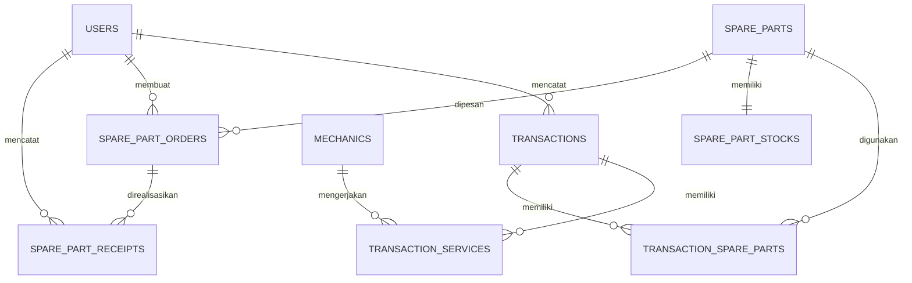

# 🔧 Sistem Informasi Penjualan Suku Cadang & Jasa Service

**UPJ Otomotif dan AHASS — BLPT DIY**

Aplikasi web terintegrasi untuk mengelola operasional bengkel, mencakup transaksi jasa servis, penjualan suku cadang, manajemen stok, order & penerimaan suku cadang, serta laporan operasional.

---

## 📋 Deskripsi

Sistem ini menggantikan proses manual (nota fisik, Excel, rekap manual) menjadi satu aplikasi web terpusat. Seluruh alur operasional bengkel — dari pencatatan transaksi hingga laporan untuk pimpinan — ditangani dalam satu platform.

### Fitur Utama

- **Manajemen User & Role** — Empat role dengan hak akses berbeda
- **Master Data** — Pengelolaan data mekanik dan suku cadang
- **Transaksi** — Jasa servis + suku cadang dalam satu nota
- **Stok Otomatis** — Pengurangan stok saat transaksi, penambahan saat penerimaan
- **Peringatan Stok Minimum** — Notifikasi saat stok mencapai batas minimum
- **Order & Penerimaan** — Alur order suku cadang ke Koperasi
- **Laporan** — Laporan operasional untuk Kepala UPJ
- **Cetak Nota** — Generate nota transaksi

---

## 👥 Role Pengguna

| Role             | Tanggung Jawab                                    |
| ---------------- | ------------------------------------------------- |
| **Admin**        | Mengelola user, mekanik, master suku cadang       |
| **Front Office** | Mencatat transaksi jasa & suku cadang, cetak nota |
| **Koperasi**     | Memproses order & penerimaan suku cadang          |
| **Kepala UPJ**   | Memantau laporan operasional                      |

---

## 🛠️ Tech Stack

| Komponen     | Teknologi                    |
| ------------ | ---------------------------- |
| Backend      | Laravel 12 (REST API)        |
| Frontend     | React.js + TypeScript (Vite) |
| Database     | MySQL                        |
| API Prefix   | `/api/v1`                    |
| Local Server | Laragon                      |

---

## 📁 Struktur Project

```
Service-Inventory-Information-System-BLPT-DIY/
├── backend/            # Laravel 12 REST API
│   ├── app/
│   │   ├── Http/
│   │   │   └── Controllers/Api/V1/
│   │   ├── Models/
│   │   └── Services/
│   ├── database/
│   │   ├── migrations/
│   │   └── seeders/
│   └── routes/
│       └── api.php
├── frontend/           # React TypeScript SPA
│   └── src/
│       ├── app/
│       ├── components/
│       ├── features/
│       ├── lib/
│       ├── styles/
│       └── types/
├── PRD/                # Dokumen PRD & rancangan
└── README.md
```

---

## 🚀 Getting Started

### Prerequisites

- PHP >= 8.2
- Composer
- Node.js >= 18
- MySQL
- Laragon (recommended) / XAMPP

### Backend Setup

```bash
cd backend
composer install
cp .env.example .env       # Sesuaikan konfigurasi database
php artisan key:generate
php artisan migrate
php artisan db:seed         # (jika seeder tersedia)
php artisan serve
```

### Frontend Setup

```bash
cd frontend
npm install
cp .env.example .env       # Sesuaikan API URL
npm run dev
```

### Konfigurasi Database (.env)

```env
DB_CONNECTION=mysql
DB_HOST=127.0.0.1
DB_PORT=3306
DB_DATABASE=blpt-diy-skema
DB_USERNAME=root
DB_PASSWORD=
```

---

## 🗄️ Database

### Tabel Utama

| Tabel                     | Fungsi                           |
| ------------------------- | -------------------------------- |
| `users`                   | Data pengguna & role             |
| `mechanics`               | Data mekanik                     |
| `spare_parts`             | Master suku cadang               |
| `spare_part_stocks`       | Stok & stok minimum              |
| `transactions`            | Transaksi utama                  |
| `transaction_services`    | Detail jasa per transaksi        |
| `transaction_spare_parts` | Detail suku cadang per transaksi |
| `spare_part_orders`       | Order suku cadang                |
| `spare_part_receipts`     | Penerimaan suku cadang           |

### Relasi



---

## 🔌 API Endpoints

### Authorizer

```
POST /api/v1/authorizer/login
GET  /api/v1/authorizer/me
POST /api/v1/authorizer/logout
```

### Admin — Master Data

```
GET|POST        /api/v1/users
GET|PUT|DELETE  /api/v1/users/{id}

GET|POST        /api/v1/mechanics
GET|PUT|DELETE  /api/v1/mechanics/{id}

GET|POST        /api/v1/spare-parts
GET|PUT|DELETE  /api/v1/spare-parts/{id}
```

### Front Office — Transaksi

```
GET|POST  /api/v1/transactions
GET       /api/v1/transactions/{id}
GET       /api/v1/invoices/{transaction}
GET       /api/v1/stocks
GET       /api/v1/stocks/minimum
```

### Koperasi — Order & Penerimaan

```
GET|POST  /api/v1/spare-part-orders
GET|PUT   /api/v1/spare-part-orders/{id}

GET|POST  /api/v1/spare-part-receipts
GET       /api/v1/spare-part-receipts/{id}
```

### Kepala UPJ — Laporan

```
GET /api/v1/reports/services
GET /api/v1/reports/spare-part-sales
GET /api/v1/reports/stocks
GET /api/v1/reports/orders
GET /api/v1/reports/mechanic-productivity
```

---

## 🧭 Frontend Routes

```
/login

/admin/dashboard
/admin/users
/admin/mechanics
/admin/spare-parts

/front-office/dashboard
/front-office/transactions/create
/front-office/transactions
/front-office/stocks
/front-office/invoices/:id

/koperasi/dashboard
/koperasi/orders
/koperasi/orders/:id
/koperasi/receipts
/koperasi/receipts/create

/kepala-upj/dashboard
/kepala-upj/reports/services
/kepala-upj/reports/spare-part-sales
/kepala-upj/reports/stocks
/kepala-upj/reports/orders
/kepala-upj/reports/mechanic-productivity
```

---

## 📦 API Response Format

### Success

```json
{
  "success": true,
  "message": "Data berhasil diambil",
  "data": {}
}
```

### List (Paginated)

```json
{
  "success": true,
  "message": "Data berhasil diambil",
  "data": [],
  "meta": {
    "current_page": 1,
    "per_page": 10,
    "total": 100
  }
}
```

### Error

```json
{
  "success": false,
  "message": "Validasi gagal",
  "errors": {
    "field": ["Pesan error"]
  }
}
```

---

## 📖 Dokumentasi

Dokumen lengkap tersedia di folder `/PRD`:

- [PRD & Rancangan Teknis](PRD/PRD_RANCANGAN_SISTEM_UPJ_AHASS_BLPT_DIY.md)

---

## 👤 Author

**Iman Mukhlisin**

---

## 📄 License

Project ini dibuat untuk keperluan akademik (Skripsi/Tugas Akhir).
